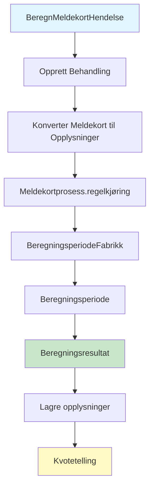
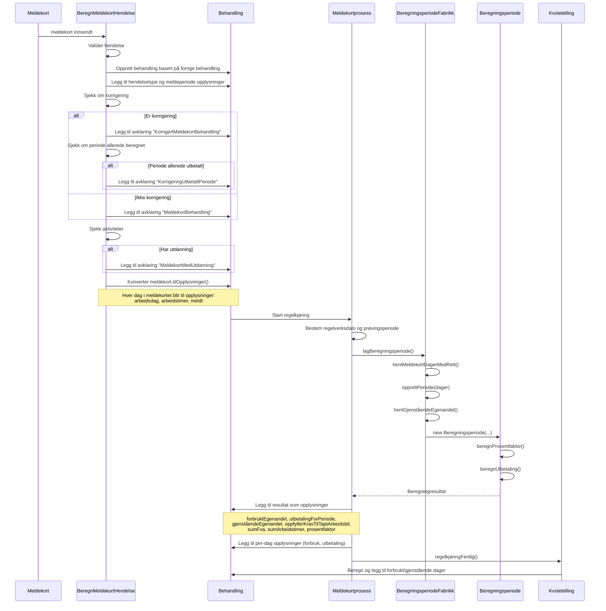
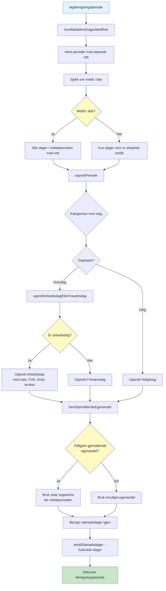
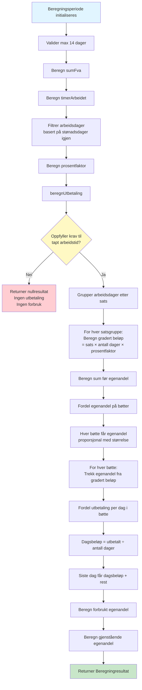
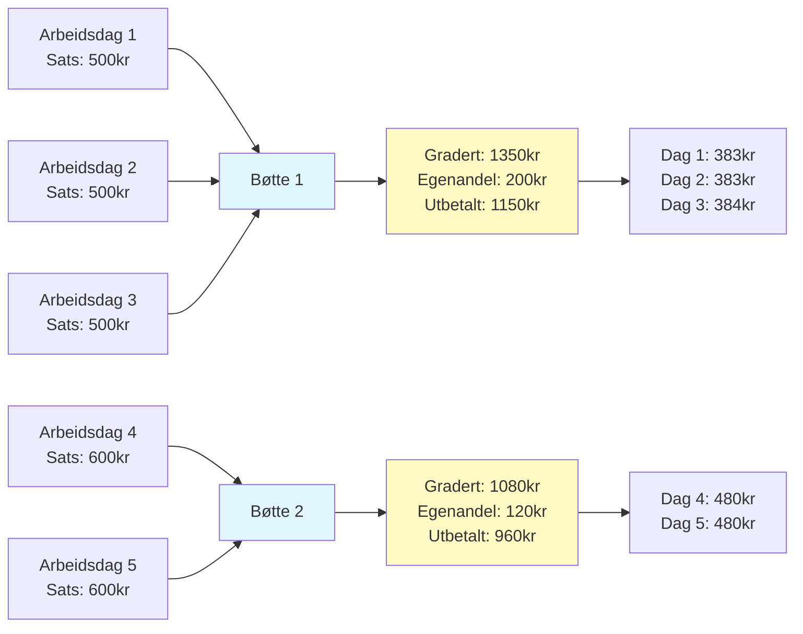
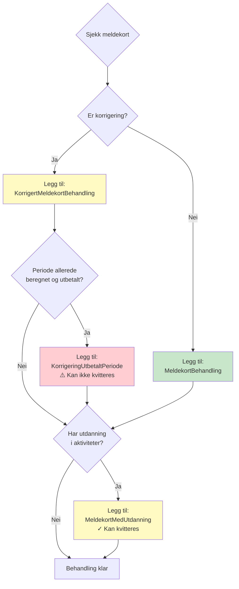
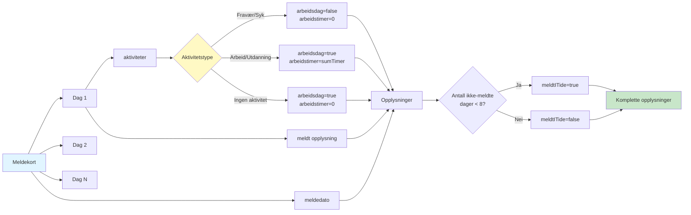
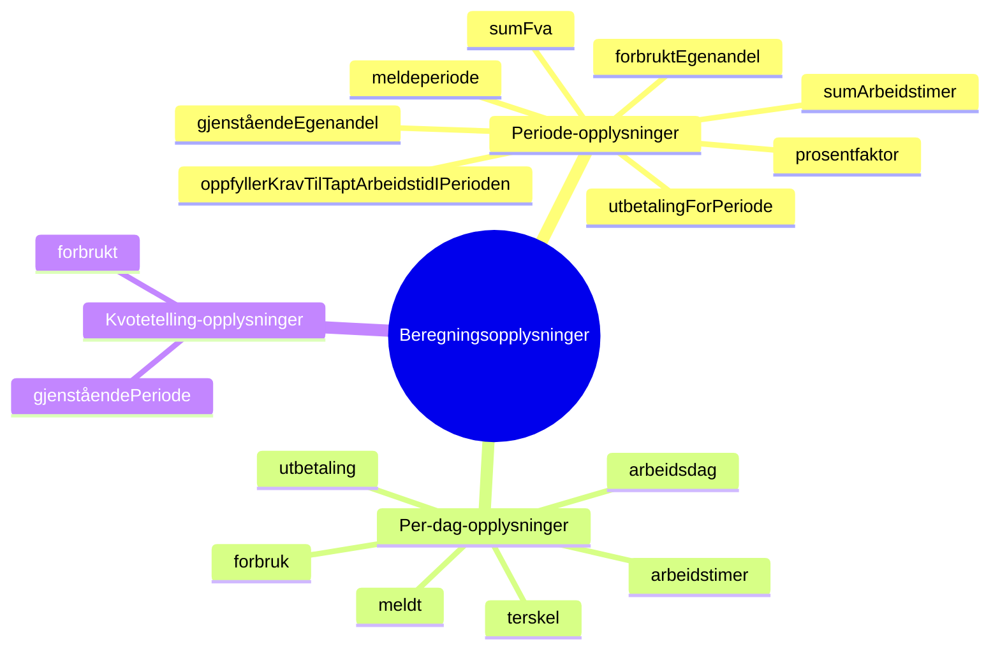
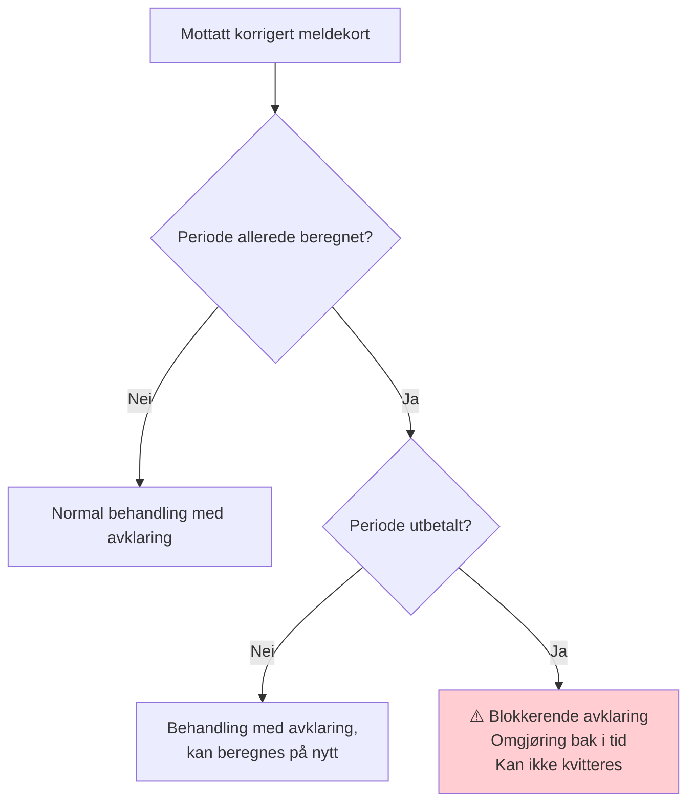

# Beregning av Meldekort - Flyt og Regler

Denne dokumentasjonen beskriver hvordan BeregnMeldekortHendelse behandles, og hvilke regler som anvendes i BeregningsperiodeFabrikk og Beregningsperiode.

## Innholdsfortegnelse
- [Overordnet flyt](#overordnet-flyt)
- [Detaljert hendelsesflyt](#detaljert-hendelsesflyt)
- [BeregningsperiodeFabrikk - Regler](#beregningsperiodefabrikk---regler)
- [Beregningsperiode - Beregningslogikk](#beregningsperiode---beregningslogikk)
- [Avklaringer](#avklaringer)
- [Dataflyt og opplysninger](#dataflyt-og-opplysninger)
- [Nøkkelkonsepter](#nøkkelkonsepter)

---

## Overordnet flyt



---

## Detaljert hendelsesflyt



---

## BeregningsperiodeFabrikk - Regler

BeregningsperiodeFabrikk er ansvarlig for å bygge opp en beregningsperiode basert på meldekortets dager og eksisterende opplysninger.



### Viktige regler i BeregningsperiodeFabrikk

1. **Dagsklassifisering**
   - Mandag-Fredag = Hverdag (kan være arbeidsdag eller fraværsdag)
   - Lørdag-Søndag = Helgedag

2. **Arbeidsdag vs Fraværsdag**
   - Arbeidsdag: Krever opplysning om arbeidsdag=true, henter dagsats, FVA, arbeidstimer og terskel
   - Fraværsdag: Når arbeidsdag=false (typisk syk/fravær)

3. **Dager med rett**
   - Filtreres basert på perioder med løpende rett (harLøpendeRett)
   - Hvis ikke meldt i tide: kun dager eksplisitt meldt inkluderes
   - Terskel for "meldt i tide": maks 8 dager ikke meldt

4. **Gjenstående egenandel**
   - Hentes fra siste registrerte egenandel før denne perioden
   - Fallback: innvilget egenandel

---

## Beregningsperiode - Beregningslogikk

Beregningsperiode utfører selve beregningen av utbetaling basert på dagene fra fabrikken.



### Beregningsformler

#### 1. Prosentfaktor
```
prosentfaktor = (sumFva - timerArbeidet) / sumFva
```
Representerer hvor stor andel av arbeidstiden som er tapt.

#### 2. Krav til tapt arbeidstid
```
terskel = (100 - snittTerskel) / 100
oppfyller = (timerArbeidet / sumFva) <= terskel
```
Standard terskel er vanligvis 50% (kan arbeide inntil 50% av vanlig arbeidstid).

#### 3. Gradert satsbeløp per gruppe
```
gradertBeløp = sats × antallDager × prosentfaktor
```

#### 4. Egenandel per bøtte
```
bøtteStørrelseIProsent = bøtteSum / sumFørEgenandel
egenandelForBøtte = gjenståendeEgenandel × bøtteStørrelseIProsent
```

#### 5. Utbetaling per bøtte
```
utbetalt = gradertBeløp - egenandelForBøtte
```

#### 6. Dagsutbetaling
```
reminder = utbetalt % antallDager
dagsbeløp = (utbetalt - reminder) / antallDager
beløpSisteDag = dagsbeløp + reminder
```

### Bøttesystemet

Når arbeidsdager har forskjellige satser (f.eks. pga. barnetillegg eller satsjusteringer), grupperes de i "bøtter":



---

## Avklaringer

BeregnMeldekortHendelse oppretter avklaringer som må behandles:



### Avklaringskoder

| Kode | Tittel | Beskrivelse | Kan avbrytes | Kan kvitteres |
|------|--------|-------------|--------------|---------------|
| **MeldekortBehandling** | Beregning av meldekort | Behandlingen er opprettet av meldekort og kan ikke automatisk behandles | Nei | Nei |
| **KorrigertMeldekortBehandling** | Beregning av korrigert meldekort | Behandlingen er korrigering av et tidligere meldekort og kan ikke automatisk behandles | Nei | Nei |
| **KorrigeringUtbetaltPeriode** | Beregning av meldekort som korrigerer tidligere periode | Behandlingen er korrigering av et tidligere meldekort og kan ikke behandles | Nei | **Nei** |
| **MeldekortMedUtdanning** | Meldekort med utdanning | Bruker har krysset av for utdanning eller tiltak på meldekortet. Må vurderes manuelt. | Nei | **Ja** |

---

## Dataflyt og opplysninger

### Meldekort til opplysninger

Meldekortet konverteres til opplysninger via `Meldekort.tilOpplysninger()`:



### Opplysninger lagt til av beregning



---

## Nøkkelkonsepter

### 1. Stønadsdager
- **Innvilget**: Totalt antall stønadsdager ved innvilgelse (typisk 52, 104 uker)
- **Forbrukt**: Akkumulert antall dager hvor det har vært forbruk
- **Gjenstående**: Innvilget - forbrukt
- **Forbruk skjer**: Kun på arbeidsdager hvor krav til tapt arbeidstid er oppfylt

### 2. Egenandel
- **Innvilget egenandel**: Beløp som må dekkes før full utbetaling (f.eks. 3000kr)
- **Gjenstående egenandel**: Oppdateres for hver meldeperiode
- **Forbrukt egenandel**: Hvor mye som trekkes i denne perioden
- **Fordeling**: Når flere satser, fordeles egenandel proporsjonalt

### 3. Fastsatt vanlig arbeidstid (FVA)
- Brukerens normale arbeidstid per uke (fordelt per dag: FVA/5)
- Brukes som baseline for å beregne tapt arbeidstid

### 4. Prosentfaktor
- Andel av arbeidstiden som er tapt: `(FVA - arbeidetTimer) / FVA`
- Brukes til å gradere dagpengesatsen
- Eksempel: FVA=37.5t, arbeidet=10t → prosentfaktor=0.73 (73% tapt)

### 5. Terskel for arbeidstidsreduksjon
- Standard 50%: Kan jobbe inntil 50% av vanlig arbeidstid og fortsatt få dagpenger
- Hvis terskelen overskrides: ingen utbetaling for perioden
- Snitt-terskel beregnes over alle arbeidsdager i perioden

### 6. Meldt i tide
- Meldekort skal meldes innen fristen
- Terskel: Max 8 dager ikke meldt i en periode
- Hvis ikke meldt i tide: kun eksplisitt meldte dager får rett

### 7. Dager med rett
- Må ha løpende rett i perioden (basert på tidligere vedtak)
- Må være meldt (enten i tide, eller eksplisitt per dag)
- Meldeperiode må overlappe med rettighetsperiode

---

## Eksempelberegning

### Scenario
- **Meldeperiode**: 14 dager (2 uker)
- **Arbeidsdager**: 10 dager (mandag-fredag)
- **FVA**: 37.5 timer/uke = 7.5 timer/dag
- **Dagsats**: 500 kr
- **Gjenstående egenandel**: 300 kr
- **Terskel**: 50%

### Periode med arbeid
- **Dag 1-5**: Arbeidet 3 timer/dag (total 15t)
- **Dag 6-10**: Arbeidet 0 timer/dag (total 0t)

### Beregning
```
sumFva = 10 dager × 7.5t = 75t
timerArbeidet = 15t
prosentfaktor = (75t - 15t) / 75t = 0.8 (80%)

Oppfyller terskel? 15t / 75t = 0.2 (20%) < 0.5 ✓

Gradert beløp = 500kr × 10 dager × 0.8 = 4000kr
Egenandel = 300kr
Utbetalt = 4000kr - 300kr = 3700kr

Reminder = 3700 % 10 = 0
Dagsbeløp = 3700 / 10 = 370kr/dag

Dag 1-9: 370kr
Dag 10: 370kr
```

### Resultat
- **Utbetaling totalt**: 3700 kr
- **Forbrukt egenandel**: 300 kr
- **Gjenstående egenandel**: 0 kr
- **Forbruksdager**: 10 dager
- **Oppfyller krav**: Ja

---

## Spesialtilfeller

### Korrigering av tidligere periode


### Ikke oppfyller krav til tapt arbeidstid
Når terskelen overskrides:
- **Ingen utbetaling** for perioden
- **Ingen forbruk** av stønadsdager
- **Ingen trekk** i egenandel
- Opplysningene registreres likevel for dokumentasjon

### Flere satser i samme periode
Eksempel: Barnetillegg starter midt i perioden
- Dag 1-7: sats 500kr
- Dag 8-10: sats 600kr (med barnetillegg)

Systemet oppretter to bøtter og fordeler egenandel proporsjonalt.

---

## Referanser til kode

| Konsept | Kodefil |
|---------|---------|
| Hendelsesbehandling | `BeregnMeldekortHendelse.kt` |
| Meldekort-modell | `MeldekortInnsendtHendelse.kt` |
| Konvertering til opplysninger | `MeldekortDagerTilOpplysning.kt` |
| Prosesstyring | `Meldekortprosess.kt` |
| Periode-oppbygging | `BeregningsperiodeFabrikk.kt` |
| Beregningslogikk | `Beregningsperiode.kt` |
| Opplysningstyper | `Beregning.kt` |
| Dag-modeller | `Dag.kt` |

---

*Dokumentasjon generert basert på kodebase per januar 2026*
