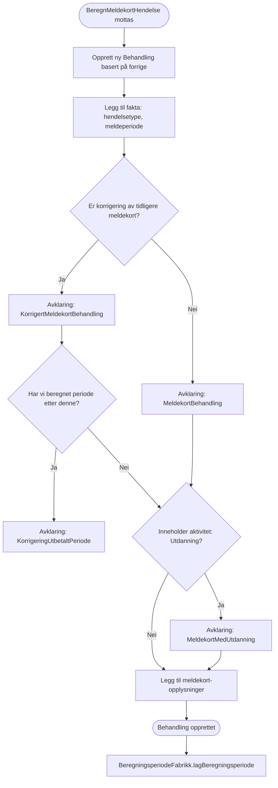
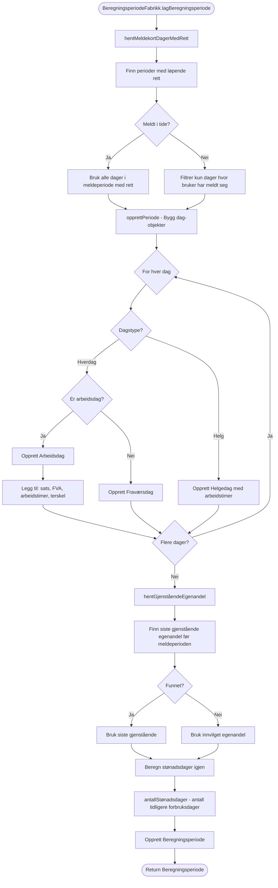
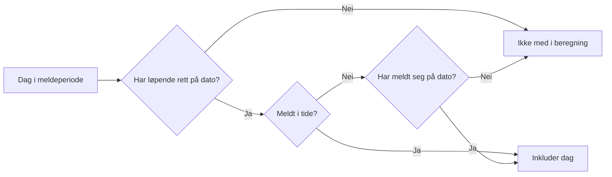
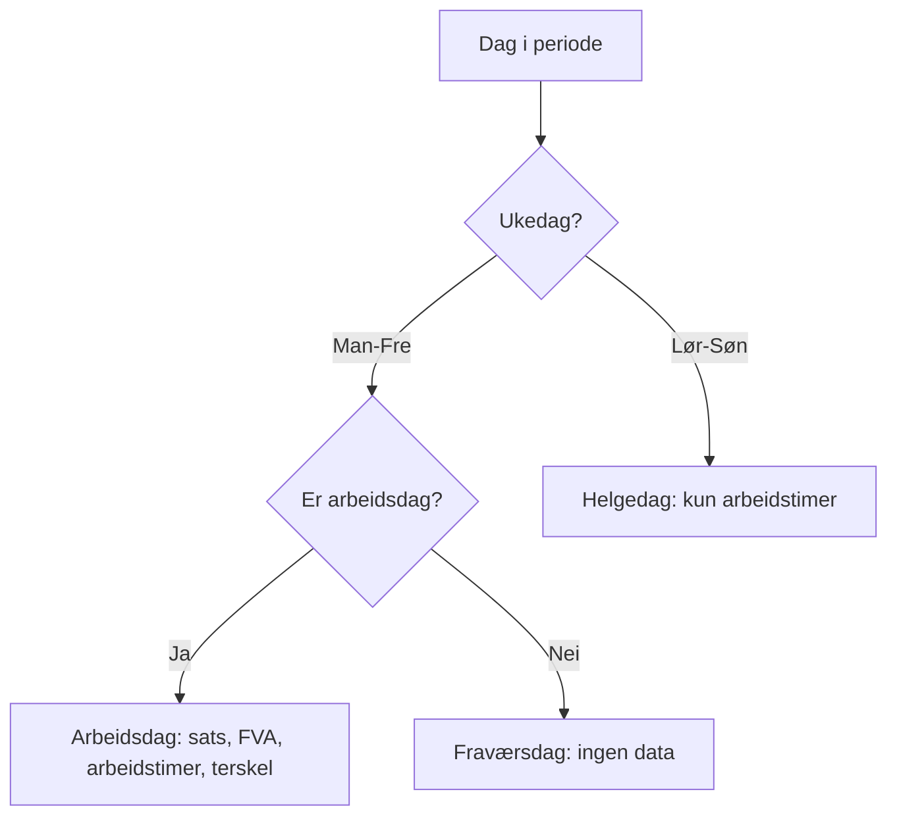
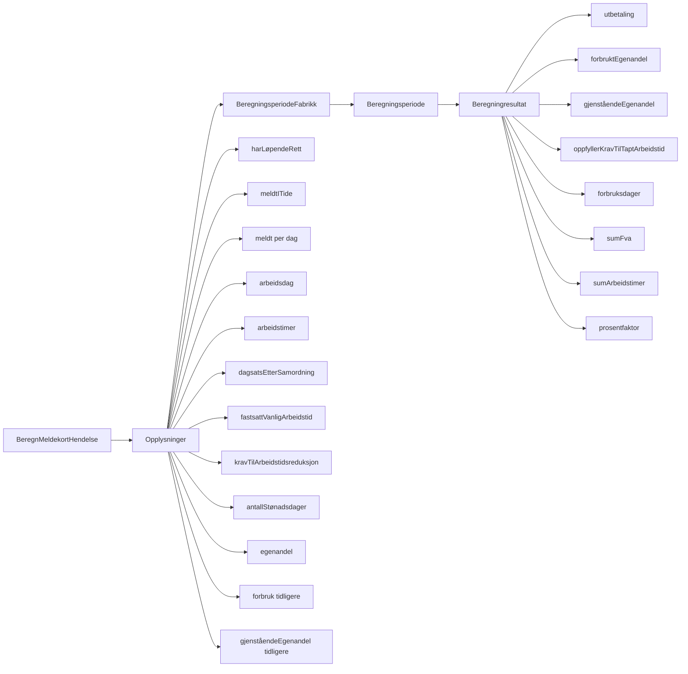

# Flytdiagram: Beregning av Meldekort

## Oversikt

Dette dokumentet beskriver flyten fra `BeregnMeldekortHendelse` mottas, hvordan `BeregningsperiodeFabrikk` bygger opp beregningsperioden, og hvilke regler som anvendes i `Beregningsperiode` for å beregne utbetaling.

## Hovedflyt



## BeregningsperiodeFabrikk - Bygging av beregningsperiode



## Beregningsperiode - Beregning av utbetaling

```mermaid
flowchart TD
    Start([Beregningsperiode constructor]) --> Validate{Max 14 dager?}
    Validate -->|Nei| Error[Kast exception]
    Validate -->|Ja| Init[Initialiser verdier]
    
    Init --> CalcSumFva[Beregn sum FVA fra alle dager]
    CalcSumFva --> FilterArbeidsdager[Filtrer arbeidsdager begrenset til stønadsdager igjen]
    FilterArbeidsdager --> CalcProsentfaktor[Beregn prosentfaktor: FVA - arbeidstimer / FVA]
    CalcProsentfaktor --> CalcTerskel[Beregn terskel: snitt av alle arbeidsdagers terskel]
    CalcTerskel --> CheckTaptArbeidstid{Oppfyller krav til tapt arbeidstid?}
    
    CheckTaptArbeidstid --> CheckFormula[arbeidstimer / sumFVA ≤ 1 - gjennomsnittlig terskel]
    CheckFormula -->|Nei| NoUtbetaling[Resultat: 0 kr utbetaling, ingen forbruk]
    CheckFormula -->|Ja| GrupperSats[Grupper arbeidsdager på sats]
    
    GrupperSats --> GraderBotte[Grader hver gruppe: sats × antall dager × prosentfaktor]
    GraderBotte --> CalcSum[Beregn sum før egenandelstrekk]
    CalcSum --> FordelEgenandel[Fordel gjenstående egenandel på bøtter proporsjonalt]
    
    FordelEgenandel --> LoopBotte{For hver bøtte}
    LoopBotte --> CalcBotteEgenandel[Egenandel = min sum før trekk, gjenstående × bøtteprosent]
    CalcBotteEgenandel --> CalcBotteUtbetaling[Utbetaling = bøttesum - egenandel]
    CalcBotteUtbetaling --> CalcDagsbelop[Dagsbeløp = utbetaling div antall dager]
    CalcDagsbelop --> CalcReminder[Reminder = utbetaling mod antall dager]
    CalcReminder --> AddReminderToLast[Legg reminder til siste dag i bøtte]
    
    AddReminderToLast --> NextBotte{Flere bøtter?}
    NextBotte -->|Ja| LoopBotte
    NextBotte -->|Nei| CreateForbruksdager[Opprett Forbruksdag for hver arbeidsdag]
    
    CreateForbruksdager --> CalcTotalUtbetaling[Sum total utbetaling fra alle bøtter]
    CalcTotalUtbetaling --> CalcForbruktEgenandel[Sum forbrukt egenandel fra alle bøtter]
    CalcForbruktEgenandel --> CalcGjenstaende[Gjenstående egenandel = tidligere - forbrukt]
    CalcGjenstaende --> ReturnResultat([Return Beregningresultat])
    
    NoUtbetaling --> ReturnResultat
```



## Nøkkelregler og validering

### BeregnMeldekortHendelse - Avklaringer

| Situasjon | Avklaring | Kan kvitteres | Beskrivelse |
|-----------|-----------|---------------|-------------|
| Korrigert meldekort | `KorrigertMeldekortBehandling` | Nei | Må behandles manuelt |
| Korrigering av utbetalt periode | `KorrigeringUtbetaltPeriode` | Nei | Omgjøring bakover i tid - kan ikke behandles |
| Normalt meldekort | `MeldekortBehandling` | Nei | Standard meldekortbehandling |
| Utdanning på meldekort | `MeldekortMedUtdanning` | Ja | Bruker har krysset av for utdanning/tiltak |

### BeregningsperiodeFabrikk - Regler for dager med rett



### BeregningsperiodeFabrikk - Dagstyper



### Beregningsperiode - Krav til tapt arbeidstid

**Formel:**
```
arbeidstimer / sumFVA ≤ (100 - gjennomsnittlig_terskel) / 100
```

**Eksempel:**
- Sum FVA: 37.5 timer
- Arbeidet: 15 timer
- Gjennomsnittlig terskel: 50%
- Beregning: 15 / 37.5 = 0.4 ≤ 0.5 ✅ Oppfylt

### Beregningsperiode - Egenandel og bøtter

1. **Gruppering:** Arbeidsdager grupperes på sats
2. **Gradering:** Hver gruppe graderes med prosentfaktor
3. **Egenandel:** Fordeles proporsjonalt på bøtter basert på deres andel av total sum
4. **Utbetaling:** Bøttesum minus egenandel, deles likt på dager i bøtten
5. **Reminder:** Rest legges til siste dag i hver bøtte

### Beregningsperiode - Begrensninger

- **Max 14 dager** i en beregningsperiode (én meldeperiode)
- **Stønadsdager igjen** begrenser antall arbeidsdager som kan forbrukes
- **Terskelstrategi:** Bruker snitt av alle arbeidsdagers terskel

## Dataflyt - Opplysninger



## Oppsummering av regler

### BeregningsperiodeFabrikk
1. **Rett-filter:** Kun dager med løpende rett
2. **Meldefilter:** Hvis ikke meldt i tide, kun dager bruker har meldt seg
3. **Dagstype-logikk:** Hverdag (arbeidsdag/fravær) vs helgedag
4. **Egenandel-henting:** Bruk siste gjenstående før periode, eller innvilget
5. **Stønadsdager:** Beregn fra innvilget minus tidligere forbruk

### Beregningsperiode
1. **Validering:** Max 14 dager per periode
2. **FVA-beregning:** Sum fastsatt vanlig arbeidstid
3. **Prosentfaktor:** (FVA - arbeidstimer) / FVA
4. **Terskelsjekk:** arbeidstimer/FVA ≤ (100-terskel)/100
5. **Arbeidsdag-begrensning:** Kun stønadsdager igjen kan forbrukes
6. **Bøtte-algoritme:** Gruppering på sats → gradering → egenandel → fordeling
7. **Reminder-håndtering:** Rest legges til siste dag i hver satsbøtte

## Viktige konsepter

- **FVA (Fastsatt Vanlig Arbeidstid):** Brukerens normale arbeidstid før dagpenger
- **Prosentfaktor:** Andel av arbeidstid som er tapt (1.0 = 100% tapt)
- **Terskel:** Hvor mye man kan jobbe samtidig med dagpenger (typisk 50%)
- **Egenandel:** Beløp som trekkes før utbetaling starter
- **Bøtte:** Gruppe av arbeidsdager med samme sats
- **Forbruksdag:** Dag som teller mot dagpengeperioden
