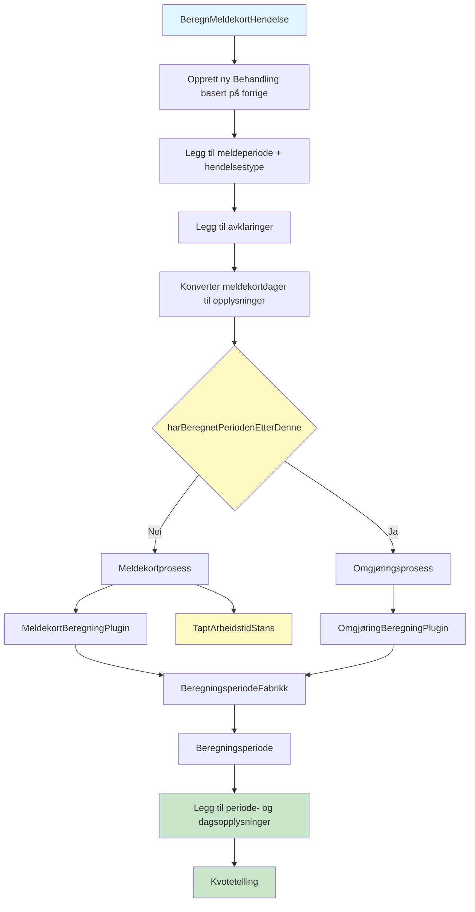
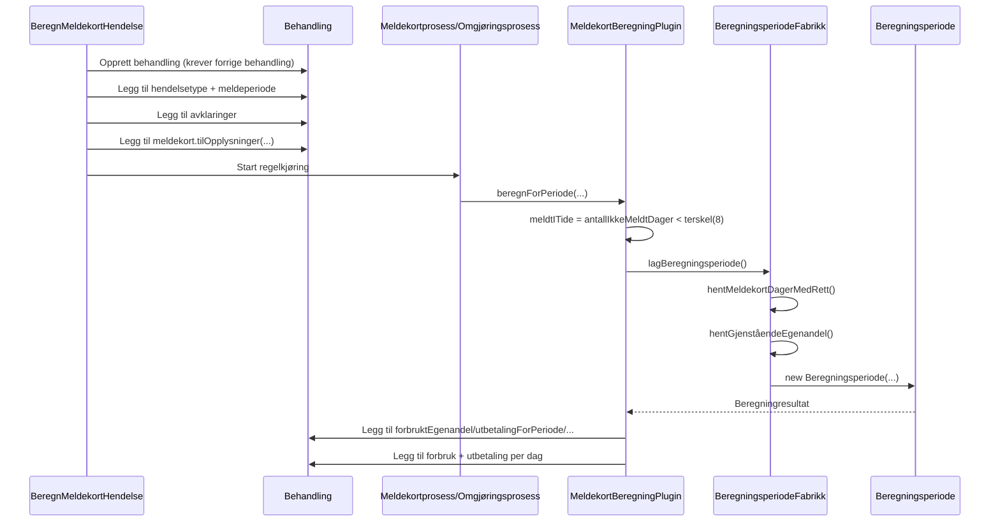
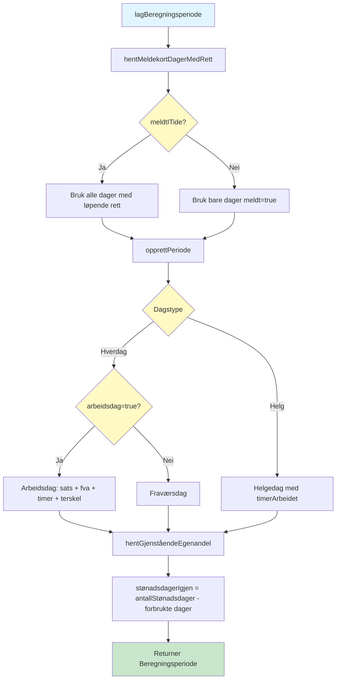
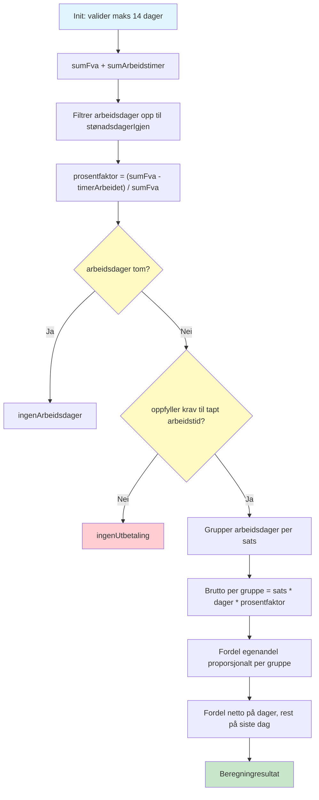
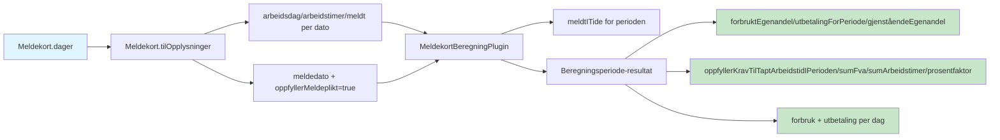

# BeregnMeldekortHendelse: flyt, regler og beregning

Denne dokumentasjonen beskriver hva som faktisk skjer i kode når et meldekort beregnes: fra `BeregnMeldekortHendelse` til `BeregningsperiodeFabrikk` og `Beregningsperiode`.

## Innholdsfortegnelse
- [Overordnet flyt](#overordnet-flyt)
- [Detaljert hendelsesflyt](#detaljert-hendelsesflyt)
- [BeregningsperiodeFabrikk](#beregningsperiodefabrikk)
- [Beregningsperiode](#beregningsperiode)
- [Avklaringer og valideringer](#avklaringer-og-valideringer)
- [Dataflyt og opplysninger](#dataflyt-og-opplysninger)
- [Nøkkelkonsepter](#nøkkelkonsepter)
- [Referanser til kode](#referanser-til-kode)

---

## Overordnet flyt

```mermaid
flowchart TD
    A[BeregnMeldekortHendelse] --> B[Opprett ny Behandling basert på forrige]
    B --> C[Legg til meldeperiode + hendelsestype]
    C --> D[Legg til avklaringer]
    D --> E[Konverter meldekortdager til opplysninger]
    E --> F{harBeregnetPeriodenEtterDenne}
    F -->|Nei| G[Meldekortprosess]
    F -->|Ja| H[Omgjøringsprosess]
    G --> I[MeldekortBeregningPlugin]
    H --> J[OmgjøringBeregningPlugin]
    I --> K[BeregningsperiodeFabrikk]
    J --> K
    K --> L[Beregningsperiode]
    L --> M[Legg til periode- og dagsopplysninger]
    M --> N[Kvotetelling]
    G --> O[TaptArbeidstidStans]

    style A fill:#e1f5ff
    style M fill:#c8e6c9
    style N fill:#c8e6c9
    style F fill:#fff9c4
    style O fill:#fff9c4
```

## Detaljert hendelsesflyt

```mermaid
sequenceDiagram
    participant H as BeregnMeldekortHendelse
    participant B as Behandling
    participant P as Meldekortprosess/Omgjøringsprosess
    participant MB as MeldekortBeregningPlugin
    participant F as BeregningsperiodeFabrikk
    participant BP as Beregningsperiode

    H->>B: Opprett behandling (krever forrige behandling)
    H->>B: Legg til hendelsetype + meldeperiode
    H->>B: Legg til avklaringer
    H->>B: Legg til meldekort.tilOpplysninger(...)
    H->>P: Start regelkjøring

    P->>MB: beregnForPeriode(...)
    MB->>MB: meldtITide = antallIkkeMeldtDager < terskel(8)
    MB->>F: lagBeregningsperiode()
    F->>F: hentMeldekortDagerMedRett()
    F->>F: hentGjenståendeEgenandel()
    F->>BP: new Beregningsperiode(...)
    BP-->>MB: Beregningresultat
    MB->>B: Legg til forbruktEgenandel/utbetalingForPeriode/...
    MB->>B: Legg til forbruk + utbetaling per dag
```

## BeregningsperiodeFabrikk

```mermaid
flowchart TD
    A[lagBeregningsperiode] --> B[hentMeldekortDagerMedRett]
    B --> C{meldtITide?}
    C -->|Ja| D[Bruk alle dager med løpende rett]
    C -->|Nei| E[Bruk bare dager meldt=true]
    D --> F[opprettPeriode]
    E --> F
    F --> G{Dagstype}
    G -->|Hverdag| H{arbeidsdag=true?}
    G -->|Helg| I[Helgedag med timerArbeidet]
    H -->|Ja| J[Arbeidsdag: sats + fva + timer + terskel]
    H -->|Nei| K[Fraværsdag]
    J --> L[hentGjenståendeEgenandel]
    K --> L
    I --> L
    L --> M[stønadsdagerIgjen = antallStønadsdager - forbrukte dager]
    M --> N[Returner Beregningsperiode]

    style A fill:#e1f5ff
    style N fill:#c8e6c9
    style C fill:#fff9c4
    style G fill:#fff9c4
    style H fill:#fff9c4
```

Viktige regler:
- Dager med rett hentes fra `KravPåDagpenger.harLøpendeRett`.
- Ved for sen melding tas bare dager med `Beregning.meldt=true`.
- `gjenståendeEgenandel` hentes fra siste tidligere verdi, ellers innvilget egenandel.
- Hverdag blir `Arbeidsdag` eller `Fraværsdag`; helg blir `Helgedag`.

## Beregningsperiode

```mermaid
flowchart TD
    A[Init: valider maks 14 dager] --> B[sumFva + sumArbeidstimer]
    B --> C[Filtrer arbeidsdager opp til stønadsdagerIgjen]
    C --> D["prosentfaktor = (sumFva - timerArbeidet) / sumFva"]
    D --> E{arbeidsdager tom?}
    E -->|Ja| F[ingenArbeidsdager]
    E -->|Nei| G{oppfyller krav til tapt arbeidstid?}
    G -->|Nei| H[ingenUtbetaling]
    G -->|Ja| I[Grupper arbeidsdager per sats]
    I --> J[Brutto per gruppe = sats * dager * prosentfaktor]
    J --> K[Fordel egenandel proporsjonalt per gruppe]
    K --> L[Fordel netto på dager, rest på siste dag]
    L --> M[Beregningresultat]

    style A fill:#e1f5ff
    style M fill:#c8e6c9
    style E fill:#fff9c4
    style G fill:#fff9c4
    style H fill:#ffcdd2
```

Formler:
- `oppfyllerKravTilTaptArbeidstid = (timerArbeidet / sumFva) <= (100 - snittTerskel) / 100`
- `bruttoBeløp = sats * antallDager * prosentfaktor`
- `egenandelForGruppe = min(gruppeBrutto, avrundet(gjenståendeEgenandel * (gruppeBrutto / totalBrutto)))`
- `nettoPerDag`: jevn fordeling, øre-rest legges på siste dag

## Avklaringer og valideringer

Fra `BeregnMeldekortHendelse`:
- `requireNotNull(forrigeBehandling)`
- `MeldekortBehandling` når meldekort ikke er korrigering
- `KorrigertMeldekortBehandling` når `korrigeringAv != null`
- `KorrigeringUtbetaltPeriode` når siste beregnede periode slutter etter `meldekort.tom`
- `MeldekortMedUtdanning` når minst én aktivitet er `Utdanning` (`kanKvitteres = true`)

## Dataflyt og opplysninger

```mermaid
flowchart LR
    A[Meldekort.dager] --> B[Meldekort.tilOpplysninger]
    B --> C[arbeidsdag/arbeidstimer/meldt per dato]
    B --> D[meldedato + oppfyllerMeldeplikt=true]
    C --> E[MeldekortBeregningPlugin]
    D --> E
    E --> F[meldtITide for perioden]
    E --> G[Beregningsperiode-resultat]
    G --> H[forbruktEgenandel/utbetalingForPeriode/gjenståendeEgenandel]
    G --> I[oppfyllerKravTilTaptArbeidstidIPerioden/sumFva/sumArbeidstimer/prosentfaktor]
    G --> J[forbruk + utbetaling per dag]

    style A fill:#e1f5ff
    style H fill:#c8e6c9
    style I fill:#c8e6c9
    style J fill:#c8e6c9
```

## Nøkkelkonsepter

- **Meldekortprosess**: beregner én meldeperiode, kjører kvotetelling og stans-vurdering.
- **Omgjøringsprosess**: re-beregner alle meldeperioder i kronologisk rekkefølge.
- **Meldt i tide**: beregnes som `antallIkkeMeldtDager < 8`.
- **Forbruk**: settes per dag basert på `forbruksdager` fra `Beregningresultat`.
- **Stans ved manglende tapt arbeidstid**: hvis antall siste påfølgende perioder uten tapt arbeidstid er større eller lik terskel (`maksAntallPerioderMedIkkeTaptArbeidstid`), legges `kravTilTaptArbeidstid=false` fra første periode i rekken og prosessen ber om rekjøring.

## Referanser til kode

| Konsept | Kodefil |
|---------|---------|
| Start av meldekortberegning | `dagpenger/src/main/kotlin/no/nav/dagpenger/regel/hendelse/BeregnMeldekortHendelse.kt` |
| Meldekort → opplysninger | `dagpenger/src/main/kotlin/no/nav/dagpenger/regel/hendelse/MeldekortDagerTilOpplysning.kt` |
| Standard prosess | `dagpenger/src/main/kotlin/no/nav/dagpenger/regel/prosess/Meldekortprosess.kt` |
| Omgjøringsprosess | `dagpenger/src/main/kotlin/no/nav/dagpenger/regel/prosess/Omgjøringsprosess.kt` |
| Meldekortberegning-plugin | `dagpenger/src/main/kotlin/no/nav/dagpenger/regel/prosess/MeldekortBeregningPlugin.kt` |
| Stans-plugin | `dagpenger/src/main/kotlin/no/nav/dagpenger/regel/prosess/TaptArbeidstidStans.kt` |
| Periodebygging | `dagpenger/src/main/kotlin/no/nav/dagpenger/regel/regelsett/beregning/BeregningsperiodeFabrikk.kt` |
| Selve beregningen | `dagpenger/src/main/kotlin/no/nav/dagpenger/regel/regelsett/beregning/Beregningsperiode.kt` |
| Opplysningstyper for beregning | `dagpenger/src/main/kotlin/no/nav/dagpenger/regel/regelsett/beregning/Beregning.kt` |
| Dag-modell brukt i beregning | `dagpenger/src/main/kotlin/no/nav/dagpenger/regel/regelsett/beregning/Dag.kt` |
