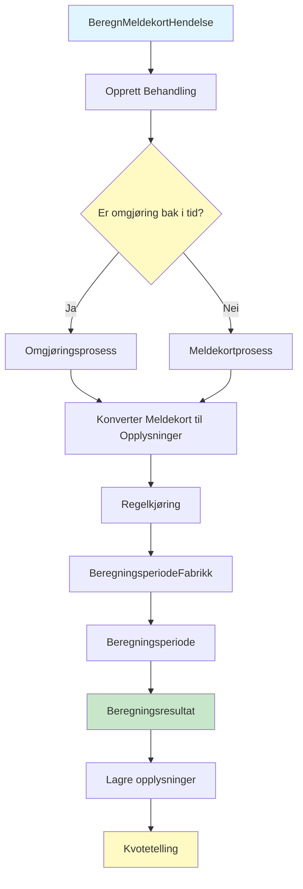
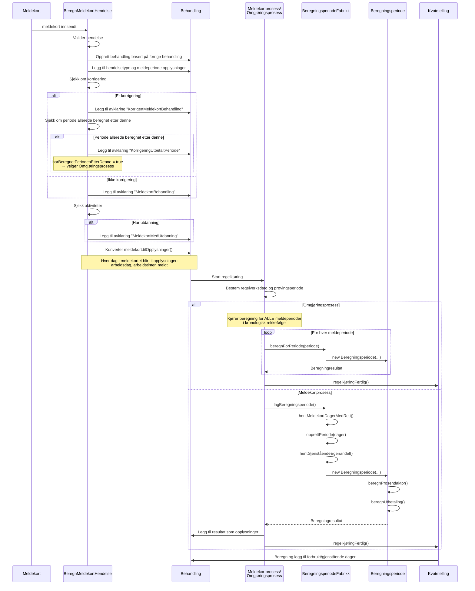
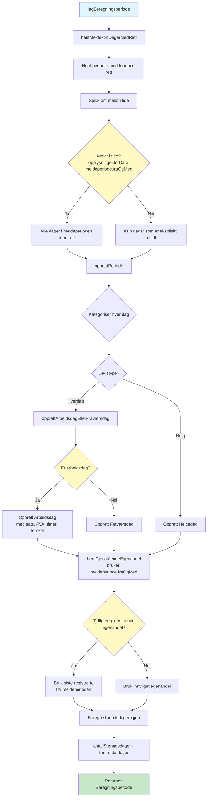
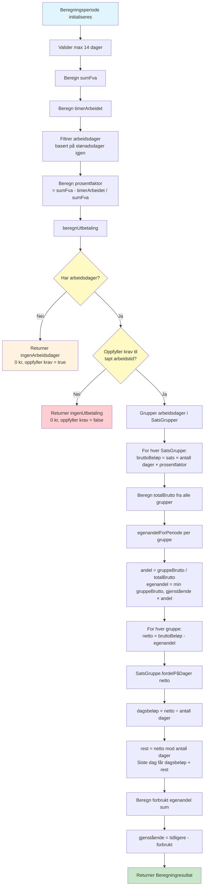
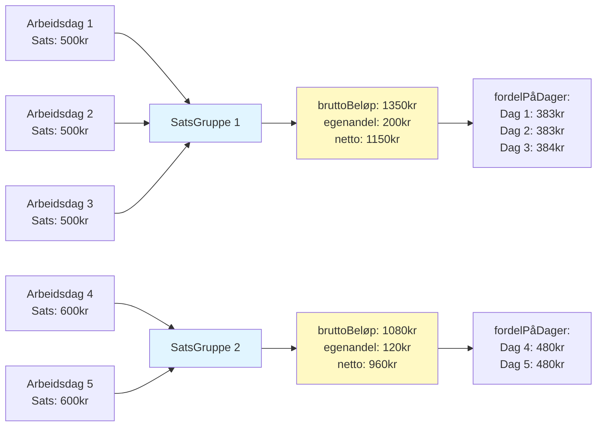
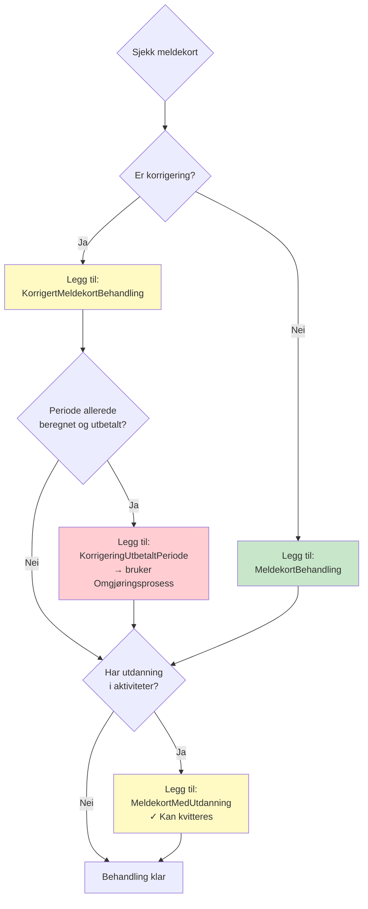
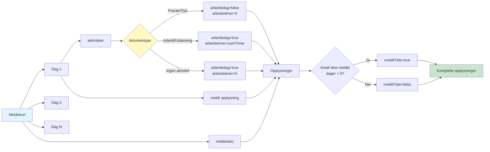
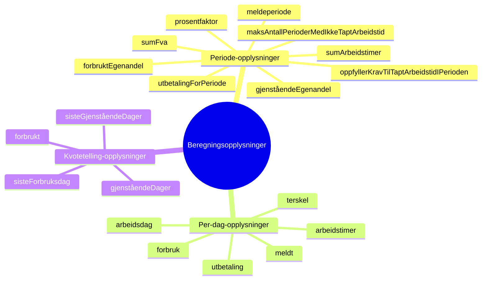
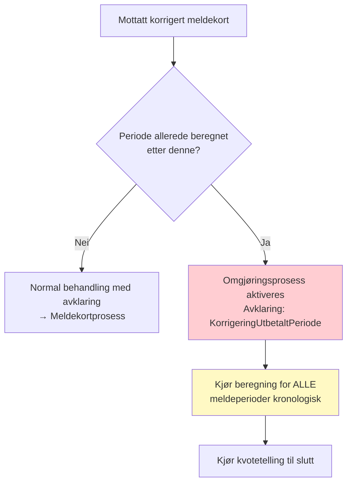

# Beregning av Meldekort - Flyt og Regler

Denne dokumentasjonen beskriver hvordan BeregnMeldekortHendelse behandles, og hvilke regler som anvendes i BeregningsperiodeFabrikk og Beregningsperiode.

## Innholdsfortegnelse
- [Overordnet flyt](#overordnet-flyt)
- [Detaljert hendelsesflyt](#detaljert-hendelsesflyt)
- [BeregningsperiodeFabrikk - Regler](#beregningsperiodefabrikk---regler)
- [Beregningsperiode - Beregningslogikk](#beregningsperiode---beregningslogikk)
- [Avklaringer](#avklaringer)
- [Dataflyt og opplysninger](#dataflyt-og-opplysninger)
- [Nøkkelkonsepter](#nøkkelkonsepter)

---

## Overordnet flyt


```mermaid
graph TB
    A[BeregnMeldekortHendelse] --> B[Opprett Behandling]
    B --> B1{Er omgjøring bak i tid?}
    B1 -->|Ja| B2[Omgjøringsprosess]
    B1 -->|Nei| B3[Meldekortprosess]
    B2 --> C[Konverter Meldekort til Opplysninger]
    B3 --> C
    C --> D[Regelkjøring]
    D --> E[BeregningsperiodeFabrikk]
    E --> F[Beregningsperiode]
    F --> G[Beregningsresultat]
    G --> H[Lagre opplysninger]
    H --> I[Kvotetelling]
    
    style A fill:#e1f5ff
    style G fill:#c8e6c9
    style I fill:#fff9c4
    style B1 fill:#fff9c4
```

> **Merk:** Hendelsen velger dynamisk mellom `Meldekortprosess` og `Omgjøringsprosess`.
> Omgjøringsprosessen brukes når korrigert meldekort gjelder en periode som allerede er beregnet fremover i tid.
> Ved omgjøring kjøres beregning for alle meldeperioder i kronologisk rekkefølge.

---

## Detaljert hendelsesflyt


```mermaid
sequenceDiagram
    participant MK as Meldekort
    participant BMH as BeregnMeldekortHendelse
    participant BEH as Behandling
    participant PROSESS as Meldekortprosess/<br/>Omgjøringsprosess
    participant BPF as BeregningsperiodeFabrikk
    participant BP as Beregningsperiode
    participant KT as Kvotetelling
    
    MK->>BMH: meldekort innsendt
    BMH->>BMH: Valider hendelse
    BMH->>BEH: Opprett behandling basert på forrige behandling
    BMH->>BEH: Legg til hendelsetype og meldeperiode opplysninger
    BMH->>BMH: Sjekk om korrigering
    
    alt Er korrigering
        BMH->>BEH: Legg til avklaring "KorrigertMeldekortBehandling"
        BMH->>BMH: Sjekk om periode allerede beregnet etter denne
        alt Periode allerede beregnet etter denne
            BMH->>BEH: Legg til avklaring "KorrigeringUtbetaltPeriode"
            Note over BMH: harBeregnetPeriodenEtterDenne = true<br/>→ velger Omgjøringsprosess
        end
    else Ikke korrigering
        BMH->>BEH: Legg til avklaring "MeldekortBehandling"
    end
    
    BMH->>BMH: Sjekk aktiviteter
    alt Har utdanning
        BMH->>BEH: Legg til avklaring "MeldekortMedUtdanning"
    end
    
    BMH->>BEH: Konverter meldekort.tilOpplysninger()
    Note over BMH,BEH: Hver dag i meldekortet blir til opplysninger:<br/>arbeidsdag, arbeidstimer, meldt
    
    BEH->>PROSESS: Start regelkjøring
    PROSESS->>PROSESS: Bestem regelverksdato og prøvingsperiode
    
    alt Omgjøringsprosess
        Note over PROSESS: Kjører beregning for ALLE meldeperioder<br/>i kronologisk rekkefølge
        loop For hver meldeperiode
            PROSESS->>BPF: beregnForPeriode(periode)
            BPF->>BP: new Beregningsperiode(...)
            BP-->>PROSESS: Beregningresultat
        end
        PROSESS->>KT: regelkjøringFerdig()
    else Meldekortprosess
        PROSESS->>BPF: lagBeregningsperiode()
        BPF->>BPF: hentMeldekortDagerMedRett()
        BPF->>BPF: opprettPeriode(dager)
        BPF->>BPF: hentGjenståendeEgenandel()
        BPF->>BP: new Beregningsperiode(...)
        BP->>BP: beregnProsentfaktor()
        BP->>BP: beregnUtbetaling()
        BP-->>PROSESS: Beregningresultat
        PROSESS->>BEH: Legg til resultat som opplysninger
        PROSESS->>KT: regelkjøringFerdig()
    end
    
    KT->>BEH: Beregn og legg til forbrukt/gjenstående dager
```

---

## BeregningsperiodeFabrikk - Regler

BeregningsperiodeFabrikk er ansvarlig for å bygge opp en beregningsperiode basert på meldekortets dager og eksisterende opplysninger.


```mermaid
flowchart TD
    START[lagBeregningsperiode] --> A[hentMeldekortDagerMedRett]
    
    A --> A1[Hent perioder med løpende rett]
    A1 --> A2[Sjekk om meldt i tide]
    
    A2 --> A3{Meldt i tide?<br/>opplysninger.forDato meldeperiode.fraOgMed}
    A3 -->|Ja| A4[Alle dager i meldeperioden med rett]
    A3 -->|Nei| A5[Kun dager som er eksplisitt meldt]
    
    A4 --> B[opprettPeriode]
    A5 --> B
    
    B --> B1{Kategoriser hver dag}
    
    B1 --> B2{Dagstype?}
    B2 -->|Hverdag| B3[opprettArbeidsdagEllerFraværsdag]
    B2 -->|Helg| B4[Opprett Helgedag]
    
    B3 --> B5{Er arbeidsdag?}
    B5 -->|Ja| B6[Opprett Arbeidsdag<br/>med sats, FVA, timer, terskel]
    B5 -->|Nei| B7[Opprett Fraværsdag]
    
    B6 --> C
    B7 --> C
    B4 --> C
    
    C[hentGjenståendeEgenandel<br/>bruker meldeperiode.fraOgMed] --> C1{Tidligere gjenstående<br/>egenandel?}
    C1 -->|Ja| C2[Bruk siste registrerte<br/>før meldeperioden]
    C1 -->|Nei| C3[Bruk innvilget egenandel]
    
    C2 --> D
    C3 --> D
    
    D[Beregn stønadsdager igjen] --> D1[antallStønadsdager - forbrukte dager]
    
    D1 --> E[Returner Beregningsperiode]
    
    style START fill:#e1f5ff
    style E fill:#c8e6c9
    style B5 fill:#fff9c4
    style A3 fill:#fff9c4
    style C1 fill:#fff9c4
```

### Viktige regler i BeregningsperiodeFabrikk

1. **Dagsklassifisering**
   - Mandag-Fredag = Hverdag (kan være arbeidsdag eller fraværsdag)
   - Lørdag-Søndag = Helgedag

2. **Arbeidsdag vs Fraværsdag**
   - Arbeidsdag: Krever opplysning om arbeidsdag=true, henter dagsats, FVA, arbeidstimer og terskel
   - Fraværsdag: Når arbeidsdag=false (typisk syk/fravær)

3. **Dager med rett**
   - Filtreres basert på perioder med løpende rett (harLøpendeRett)
   - Hvis ikke meldt i tide: kun dager eksplisitt meldt inkluderes
   - Terskel for "meldt i tide": maks 8 dager ikke meldt

4. **Gjenstående egenandel**
   - Hentes fra siste registrerte egenandel før denne perioden
   - Fallback: innvilget egenandel

---

## Beregningsperiode - Beregningslogikk

Beregningsperiode utfører selve beregningen av utbetaling basert på dagene fra fabrikken.


```mermaid
flowchart TD
    START[Beregningsperiode initialiseres] --> V1[Valider max 14 dager]
    V1 --> A[Beregn sumFva]
    A --> B[Beregn timerArbeidet]
    B --> C[Filtrer arbeidsdager<br/>basert på stønadsdager igjen]
    C --> D[Beregn prosentfaktor<br/>= sumFva - timerArbeidet / sumFva]
    
    D --> E[beregnUtbetaling]
    
    E --> E0{Har arbeidsdager?}
    E0 -->|Nei| G0[Returner ingenArbeidsdager<br/>0 kr, oppfyller krav = true]
    
    E0 -->|Ja| F{Oppfyller krav til<br/>tapt arbeidstid?}
    
    F -->|Nei| G[Returner ingenUtbetaling<br/>0 kr, oppfyller krav = false]
    
    F -->|Ja| H[Grupper arbeidsdager i SatsGrupper]
    
    H --> I[For hver SatsGruppe:<br/>bruttoBeløp = sats × antall dager × prosentfaktor]
    
    I --> J[Beregn totalBrutto fra alle grupper]
    
    J --> K[egenandelForPeriode per gruppe]
    K --> K1[andel = gruppeBrutto / totalBrutto<br/>egenandel = min gruppeBrutto, gjenstående × andel]
    
    K1 --> L[For hver gruppe:<br/>netto = bruttoBeløp - egenandel]
    
    L --> M[SatsGruppe.fordelPåDager netto]
    M --> M1[dagsbeløp = netto ÷ antall dager]
    M1 --> M2[rest = netto mod antall dager<br/>Siste dag får dagsbeløp + rest]
    
    M2 --> N[Beregn forbrukt egenandel sum]
    N --> O[gjenstående = tidligere - forbrukt]
    
    O --> P[Returner Beregningresultat]
    
    style START fill:#e1f5ff
    style P fill:#c8e6c9
    style G fill:#ffcdd2
    style G0 fill:#fff3e0
    style F fill:#fff9c4
    style E0 fill:#fff9c4
```

### Beregningsformler

#### 1. Prosentfaktor
```
prosentfaktor = ((sumFva - timerArbeidet) / sumFva).timer
```
Representerer hvor stor andel av arbeidstiden som er tapt. Returneres som `Double`.

#### 2. Krav til tapt arbeidstid
```
terskel = (100 - snittTerskel) / 100
oppfyller = (timerArbeidet / sumFva).timer <= terskel
```
Standard terskel er vanligvis 50% (kan arbeide inntil 50% av vanlig arbeidstid).

#### 3. Tidlig retur
Beregningen har to tidlige returer:
- **Ingen arbeidsdager**: Returnerer `ingenArbeidsdager` (0 kr, men `oppfyllerKravTilTaptArbeidstid = true`)
- **Ikke oppfylt terskel**: Returnerer `ingenUtbetaling` (0 kr, `oppfyllerKravTilTaptArbeidstid = false`)

#### 4. Gradert brutto per SatsGruppe
```
bruttoBeløp = sats × antallDager × prosentfaktor
```

#### 5. Egenandel per gruppe (`egenandelForPeriode`)
```
andel = gruppeBrutto / totalBrutto
beregnetEgenandel = avrund(gjenståendeEgenandel × andel)
egenandel = min(gruppeBrutto, beregnetEgenandel)
```

#### 6. Netto utbetaling per gruppe
```
netto = avrund(bruttoBeløp - egenandel)
```

#### 7. Dagsutbetaling (`SatsGruppe.fordelPåDager`)
```
rest = netto % antallDager
dagsbeløp = (netto - rest) / antallDager
sisteDag = dagsbeløp + rest
```

### SatsGruppe-systemet

Når arbeidsdager har forskjellige satser (f.eks. pga. barnetillegg eller satsjusteringer), grupperes de i `SatsGruppe`-objekter. Hver gruppe har en `bruttoBeløp` og en `fordelPåDager`-metode:


```mermaid
graph LR
    A[Arbeidsdag 1<br/>Sats: 500kr] --> B1[SatsGruppe 1]
    A2[Arbeidsdag 2<br/>Sats: 500kr] --> B1
    A3[Arbeidsdag 3<br/>Sats: 500kr] --> B1
    
    A4[Arbeidsdag 4<br/>Sats: 600kr] --> B2[SatsGruppe 2]
    A5[Arbeidsdag 5<br/>Sats: 600kr] --> B2
    
    B1 --> C1[bruttoBeløp: 1350kr<br/>egenandel: 200kr<br/>netto: 1150kr]
    B2 --> C2[bruttoBeløp: 1080kr<br/>egenandel: 120kr<br/>netto: 960kr]
    
    C1 --> D1[fordelPåDager:<br/>Dag 1: 383kr<br/>Dag 2: 383kr<br/>Dag 3: 384kr]
    C2 --> D2[fordelPåDager:<br/>Dag 4: 480kr<br/>Dag 5: 480kr]
    
    style B1 fill:#e1f5ff
    style B2 fill:#e1f5ff
    style C1 fill:#fff9c4
    style C2 fill:#fff9c4
```

---

## Avklaringer

BeregnMeldekortHendelse oppretter avklaringer som må behandles:


```mermaid
flowchart TD
    START{Sjekk meldekort} --> K{Er korrigering?}
    
    K -->|Ja| K1[Legg til:<br/>KorrigertMeldekortBehandling]
    K1 --> K2{Periode allerede<br/>beregnet og utbetalt?}
    K2 -->|Ja| K3[Legg til:<br/>KorrigeringUtbetaltPeriode<br/>→ bruker Omgjøringsprosess]
    K2 -->|Nei| U
    
    K -->|Nei| M[Legg til:<br/>MeldekortBehandling]
    
    K3 --> U
    M --> U
    
    U{Har utdanning<br/>i aktiviteter?}
    U -->|Ja| U1[Legg til:<br/>MeldekortMedUtdanning<br/>✓ Kan kvitteres]
    U -->|Nei| END
    
    U1 --> END[Behandling klar]
    
    style K1 fill:#fff9c4
    style K3 fill:#ffcdd2
    style M fill:#c8e6c9
    style U1 fill:#fff9c4
```

### Avklaringskoder

| Kode | Tittel | Beskrivelse | Kan avbrytes | Kan kvitteres |
|------|--------|-------------|--------------|---------------|
| **MeldekortBehandling** | Beregning av meldekort | Behandlingen er opprettet av meldekort og kan ikke automatisk behandles | Nei | Nei |
| **KorrigertMeldekortBehandling** | Beregning av korrigert meldekort | Behandlingen er korrigering av et tidligere meldekort og kan ikke automatisk behandles | Nei | Nei |
| **KorrigeringUtbetaltPeriode** | Beregning av meldekort som korrigerer tidligere periode | Behandlingen er korrigering av et tidligere beregnet meldekort | Nei | Nei |
| **MeldekortMedUtdanning** | Meldekort med utdanning | Bruker har krysset av for utdanning eller tiltak på meldekortet. Må vurderes manuelt. | Nei | **Ja** |

---

## Dataflyt og opplysninger

### Meldekort til opplysninger

Meldekortet konverteres til opplysninger via `Meldekort.tilOpplysninger()`:


```mermaid
flowchart LR
    MK[Meldekort] --> D1[Dag 1]
    MK --> D2[Dag 2]
    MK --> DN[Dag N]
    MK --> MD[meldedato]
    
    D1 --> A1[aktiviteter]
    A1 --> AV{Aktivitetstype}
    
    AV -->|Fravær/Syk| F1[arbeidsdag=false<br/>arbeidstimer=0]
    AV -->|Arbeid/Utdanning| F2[arbeidsdag=true<br/>arbeidstimer=sumTimer]
    AV -->|Ingen aktivitet| F3[arbeidsdag=true<br/>arbeidstimer=0]
    
    D1 --> M1[meldt opplysning]
    
    F1 --> OPP[Opplysninger]
    F2 --> OPP
    F3 --> OPP
    M1 --> OPP
    MD --> OPP
    
    OPP --> TI{Antall ikke-meldte<br/>dager < 8?}
    TI -->|Ja| TI1[meldtITide=true]
    TI -->|Nei| TI2[meldtITide=false]
    
    TI1 --> FINAL[Komplette opplysninger]
    TI2 --> FINAL
    
    style MK fill:#e1f5ff
    style FINAL fill:#c8e6c9
    style AV fill:#fff9c4
```

### Opplysninger lagt til av beregning


```mermaid
mindmap
  root((Beregningsopplysninger))
    Periode-opplysninger
      meldeperiode
      forbruktEgenandel
      utbetalingForPeriode
      gjenståendeEgenandel
      oppfyllerKravTilTaptArbeidstidIPerioden
      sumFva
      sumArbeidstimer
      prosentfaktor
      maksAntallPerioderMedIkkeTaptArbeidstid
    Per-dag-opplysninger
      forbruk
      utbetaling
      arbeidsdag
      arbeidstimer
      meldt
      terskel
    Kvotetelling-opplysninger
      forbrukt
      gjenståendeDager
      sisteForbruksdag
      sisteGjenståendeDager
```

---

## Nøkkelkonsepter

### 1. Stønadsdager
- **Innvilget**: Totalt antall stønadsdager ved innvilgelse (typisk 52, 104 uker)
- **Forbrukt**: Akkumulert antall dager hvor det har vært forbruk
- **Gjenstående** (`gjenståendeDager`): Innvilget - forbrukt
- **Siste gjenstående** (`sisteGjenståendeDager`): Initialiseres som `høyesteAv(antallStønadsdager)`
- **Siste forbruksdag** (`sisteForbruksdag`): Siste dato hvor forbruk ble registrert
- **Forbruk skjer**: Kun på arbeidsdager hvor krav til tapt arbeidstid er oppfylt

### 2. Egenandel
- **Innvilget egenandel**: Beløp som må dekkes før full utbetaling (f.eks. 3000kr)
- **Gjenstående egenandel**: Oppdateres for hver meldeperiode
- **Forbrukt egenandel**: Hvor mye som trekkes i denne perioden
- **Fordeling**: Når flere satser, fordeles egenandel proporsjonalt

### 3. Fastsatt vanlig arbeidstid (FVA)
- Brukerens normale arbeidstid per uke (fordelt per dag: FVA/5)
- Brukes som baseline for å beregne tapt arbeidstid

### 4. Prosentfaktor
- Andel av arbeidstiden som er tapt: `(FVA - arbeidetTimer) / FVA`
- Brukes til å gradere dagpengesatsen
- Eksempel: FVA=37.5t, arbeidet=10t → prosentfaktor=0.73 (73% tapt)

### 5. Terskel for arbeidstidsreduksjon
- Standard 50%: Kan jobbe inntil 50% av vanlig arbeidstid og fortsatt få dagpenger
- Hvis terskelen overskrides: ingen utbetaling for perioden
- Snitt-terskel beregnes over alle arbeidsdager i perioden

### 6. Meldt i tide
- Meldekort skal meldes innen fristen
- Terskel: Max 8 dager ikke meldt i en periode
- Hvis ikke meldt i tide: kun eksplisitt meldte dager får rett
- Oppslag gjøres med `opplysninger.forDato(meldeperiode.fraOgMed)`

### 7. Dager med rett
- Må ha løpende rett i perioden (basert på tidligere vedtak)
- Må være meldt (enten i tide, eller eksplisitt per dag)
- Meldeperiode må overlappe med rettighetsperiode

### 8. Forretningsprosess (Meldekortprosess vs Omgjøringsprosess)
- **Meldekortprosess**: Standard prosess for nye og korrigerte meldekort
- **Omgjøringsprosess**: Brukes når korrigering gjelder periode som allerede er beregnet fremover i tid (`harBeregnetPeriodenEtterDenne = true`)
- Omgjøringsprosessen kjører beregning for **alle** meldeperioder i kronologisk rekkefølge
- Valget av prosess gjøres dynamisk via `get()` på `forretningsprosess`-propertyen

### 9. Maks antall perioder med ikke-tapt arbeidstid
- Ny opplysning: `maksAntallPerioderMedIkkeTaptArbeidstid`
- Initialiseres til 3 som utgangspunkt (`somUtgangspunkt(3)`)
- Begrenser antall påfølgende perioder en bruker kan ha uten tapt arbeidstid

---

## Eksempelberegning

### Scenario
- **Meldeperiode**: 14 dager (2 uker)
- **Arbeidsdager**: 10 dager (mandag-fredag)
- **FVA**: 37.5 timer/uke = 7.5 timer/dag
- **Dagsats**: 500 kr
- **Gjenstående egenandel**: 300 kr
- **Terskel**: 50%

### Periode med arbeid
- **Dag 1-5**: Arbeidet 3 timer/dag (total 15t)
- **Dag 6-10**: Arbeidet 0 timer/dag (total 0t)

### Beregning
```
sumFva = 10 dager × 7.5t = 75t
timerArbeidet = 15t
prosentfaktor = (75t - 15t) / 75t = 0.8 (80%)

Oppfyller terskel? 15t / 75t = 0.2 (20%) < 0.5 ✓

Gradert beløp = 500kr × 10 dager × 0.8 = 4000kr
Egenandel = 300kr
Utbetalt = 4000kr - 300kr = 3700kr

Reminder = 3700 % 10 = 0
Dagsbeløp = 3700 / 10 = 370kr/dag

Dag 1-9: 370kr
Dag 10: 370kr
```

### Resultat
- **Utbetaling totalt**: 3700 kr
- **Forbrukt egenandel**: 300 kr
- **Gjenstående egenandel**: 0 kr
- **Forbruksdager**: 10 dager
- **Oppfyller krav**: Ja

---

## Spesialtilfeller

### Korrigering av tidligere periode

```mermaid
flowchart TD
    K[Mottatt korrigert meldekort] --> K1{Periode allerede beregnet<br/>etter denne?}
    K1 -->|Nei| K2[Normal behandling med avklaring<br/>→ Meldekortprosess]
    K1 -->|Ja| K3[Omgjøringsprosess aktiveres<br/>Avklaring: KorrigeringUtbetaltPeriode]
    K3 --> K4[Kjør beregning for ALLE<br/>meldeperioder kronologisk]
    K4 --> K5[Kjør kvotetelling til slutt]
    
    style K3 fill:#ffcdd2
    style K4 fill:#fff9c4
```

### Ikke oppfyller krav til tapt arbeidstid
Når terskelen overskrides:
- **Ingen utbetaling** for perioden
- **Ingen forbruk** av stønadsdager
- **Ingen trekk** i egenandel
- Opplysningene registreres likevel for dokumentasjon

### Ingen arbeidsdager i perioden
Når alle dager er fravær/helg (ingen arbeidsdager):
- **Ingen utbetaling** for perioden
- **Oppfyller krav** (`oppfyllerKravTilTaptArbeidstid = true`)
- **Ingen forbruk** av stønadsdager
- Alle timer/FVA settes til 0

### Flere satser i samme periode
Eksempel: Barnetillegg starter midt i perioden
- Dag 1-7: sats 500kr
- Dag 8-10: sats 600kr (med barnetillegg)

Systemet oppretter to SatsGrupper og fordeler egenandel proporsjonalt.

---

## Referanser til kode

| Konsept | Kodefil |
|---------|---------|
| Hendelsesbehandling | `BeregnMeldekortHendelse.kt` |
| Meldekort-modell | `MeldekortInnsendtHendelse.kt` |
| Konvertering til opplysninger | `MeldekortDagerTilOpplysning.kt` |
| Standard prosesstyring | `Meldekortprosess.kt` |
| Omgjøringsprosess | `Omgjøringsprosess.kt` |
| Periode-oppbygging | `BeregningsperiodeFabrikk.kt` |
| Beregningslogikk | `Beregningsperiode.kt` |
| Opplysningstyper | `Beregning.kt` |
| Dag-modeller | `Dag.kt` |

---

*Dokumentasjon oppdatert basert på kodebase per april 2026*
