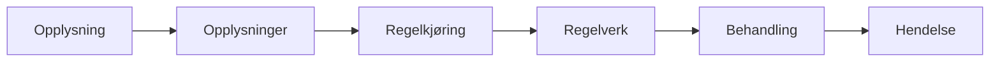
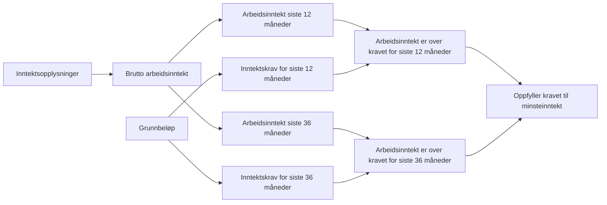
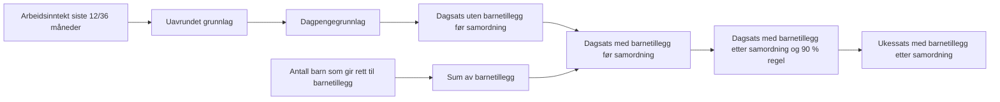
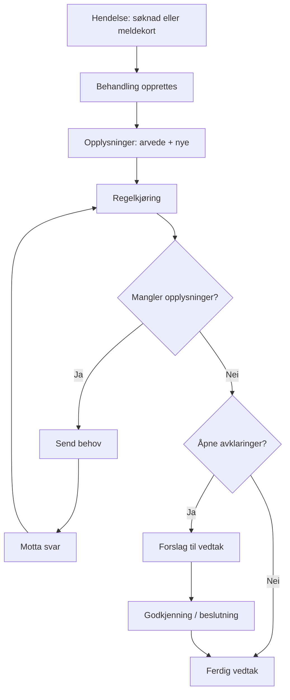

# Hva er dp-behandling?

dp-behandling er motoren som:

- tar imot en hendelse (for eksempel søknad),
- samler inn opplysninger,
- kjører regler,
- vurderer avklaringer,
- og avslutter i vedtak eller forslag til vedtak.

---

# Seks lag i modellen

1. **Opplysning**: ett konkret faktum eller vurdert verdi.
2. **Opplysninger**: hele samlingen av fakta.
3. **Regelkjøring**: utleder nye opplysninger.
4. **Regelverk**: hvilke regler som gjelder.
5. **Behandling**: prosessen og tilstandene i saken.
6. **Hendelse**: det som starter/driver saken videre.

[tegninger](https://excalidraw.com/#json=3QLZSA8Wyiv_wLrssvrxA,Z-Ue5OLUZsbOCzhTic9w-g)

---

# Løkmodellen (innerst til ytterst)

Lesning: Innerst er enkeltfakta, ytterst er hendelser som setter hele kjeden i bevegelse.

---

# Hva er en opplysning?

En opplysning i dp-behandling har blant annet:

- type (hva slags opplysning),
- verdi,
- gyldighetsperiode,
- kilde (ekstern, intern, utledet),
- sporbarhet (hva den kommer fra).

Systemet skiller også mellom **hypotese** (foreløpig) og **faktum** (bekreftet).

---

# Gyldighetsperiode: når en opplysning gjelder

Gyldighetsperiode betyr at en opplysning gjelder i et bestemt tidsrom.

Eksempel:
- **Registrert som arbeidssøker** kan være gyldig fra en dato.
- **Arbeidsinntekt siste 12 måneder** vurderes for en bestemt prøvingsdato.

Hvorfor viktig:
- Regelkjøring bruker opplysninger som er gyldige på riktig dato.
- Samme person kan ha ulike gyldige opplysninger i ulike perioder.

---

# Konkrete opplysninger i dagpenger-regelverket

Eksempler brukt i regelverket:

- **Søknadsdato**
- **Prøvingsdato**
- **Registrert som arbeidssøker**
- **Bostedsland er Norge**
- **Arbeidsinntekt siste 12 måneder**
- **Arbeidsinntekt siste 36 måneder**
- **Oppfyller kravet til minsteinntekt**
- **Dagpengegrunnlag**
- **Dagsats med barnetillegg etter samordning og 90 % regel**
- **Antall stønadsuker (stønadsperiode)**

---

# Input-opplysninger og utledede opplysninger

Input (kommer inn via behov/svar):

- Registrert som arbeidssøker
- Bostedsland er Norge
- Inntektsopplysninger
- Ønsket arbeidstid

Utledet (beregnes i regelkjøring):

- Oppfyller kravet til opphold i Norge eller unntak
- Oppfyller kravet til minsteinntekt
- Reell arbeidssøker
- Dagpengegrunnlag
- Antall stønadsuker (stønadsperiode)

---

# Regelkjøring i praksis

Regelkjøringen går i sløyfer:

1. Aktiverer regler for aktuell dato.
2. Lager plan for hvilke opplysninger som må produseres.
3. Utleder nye opplysninger med interne regler.
4. Stopper når en ekstern opplysning mangler.
5. Sender behov.
6. Fortsetter når svar kommer inn.

Resultatet er enten ferdig vurdering eller presist informasjonsbehov.

---

# Eksempel: fra inntekt til minsteinntekt

---

# Eksempel: fra grunnlag til ytelse

---

# Behandling: prosessen rundt regelmotoren

Behandling holder styr på tilstand:

- Under opprettelse
- Under behandling
- Forslag til vedtak
- Til godkjenning / til beslutning
- Ferdig eller avbrutt

Når regelkjøring er ferdig vurderes avklaringer og om vedtak kan automatiseres.

---

# Helhetlig flyt: hendelse til vedtak

---

# Hvorfor denne modellen er nyttig

For fag og design:

- **Forklarbarhet**: vi kan vise hvorfor et resultat ble som det ble.
- **Sporbarhet**: vi kan følge vei fra regel til opplysning.
- **Forutsigbarhet**: samme grunnlag gir samme maskinelle vurdering.
- **Samspill menneske/maskin**: avklaringer håndterer det som ikke kan automatiseres fullt ut.

---

# Ordliste (enkelt språk)

| Begrep | Praktisk betydning |
|---|---|
| Opplysning | Ett konkret datapunkt i saken |
| Opplysninger | Hele datagrunnlaget saken bygger på |
| Regelkjøring | Motoren som vurderer og utleder |
| Avklaring | Punkt som krever manuell oppfølging/vurdering |
| Behandling | Hele saksløpet frem til vedtak |
| Vedtak | Endelig beslutning basert på behandlingen |
