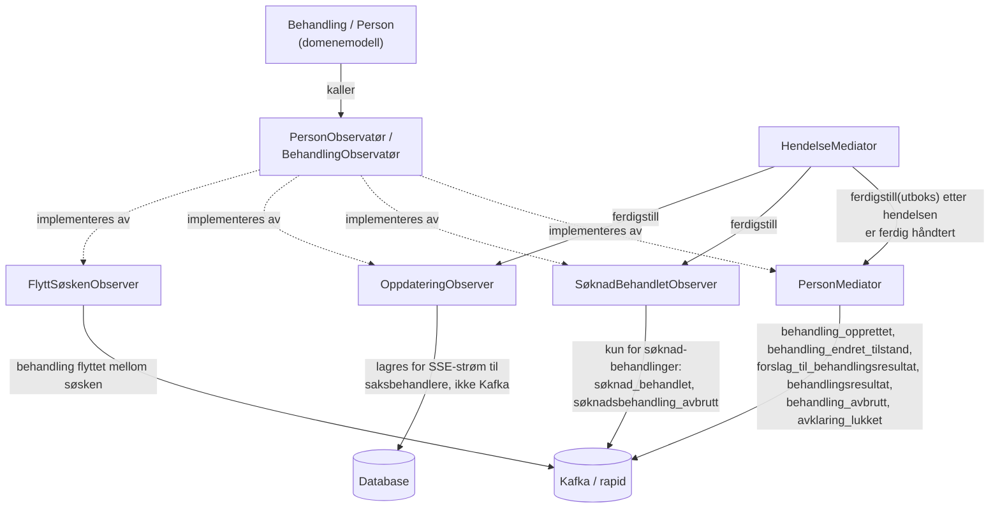

# Kafka-hendelser i dp-behandling

Katalog over hendelser publisert på rapid-topicet, generert fra `webhooks`-seksjonen i `openapi/src/main/resources/behandling-api.yaml`. Ikke rediger denne fila manuelt — den overskrives av `KafkaHendelserDokumentasjonTest`. Selve schemaet (felter/typer) dekkes av OpenAPI-speccen selv; her lenker vi bare dit.

## Hvordan hendelser publiseres

```mermaid
flowchart TD
    B["Behandling / Person\n(domenemodell)"] -->|kaller| O["PersonObservatør /\nBehandlingObservatør"]
    O -.implementeres av.-> PM[PersonMediator]
    O -.implementeres av.-> SB[SøknadBehandletObserver]
    O -.implementeres av.-> OO["OppdateringObserver"]
    O -.implementeres av.-> FS["FlyttSøskenObserver"]

    PM -->|behandling_opprettet, behandling_endret_tilstand,\nforslag_til_behandlingsresultat, behandlingsresultat,\nbehandling_avbrutt, avklaring_lukket| K[(Kafka / rapid)]
    SB -->|kun for søknad-behandlinger:\nsøknad_behandlet, søknadsbehandling_avbrutt| K
    FS -->|behandling flyttet mellom søsken| K
    OO -->|lagres for SSE-strøm til\nsaksbehandlere, ikke Kafka| DB[(Database)]

    HM["HendelseMediator"] -->|"ferdigstill(utboks) etter hendelsen\ner ferdig håndtert"| PM
    HM -->|ferdigstill| SB
    HM -->|ferdigstill| OO
```

Alle observatørene registreres på `Person` i `HendelseMediator` og samler opp meldinger i
minnet mens hendelsen behandles. Når hendelsen er ferdig håndtert, kaller `HendelseMediator`
`ferdigstill(...)` på hver observatør, som da skriver meldingene til utboksen (samme
transaksjon som resten av behandlingen — se `FlyttSøskenObserver` for et unntak som bruker
rapid-context direkte).

En ny Kafka-hendelse legges typisk til ved å implementere ett eller flere metoder på
`PersonObservatør`/`BehandlingObservatør` i en (ny eller eksisterende) observatør, publisere
med `toJsonMessage(eventName, dto)` og en typet DTO (se `SøknadBehandletObserver.kt`), og
dokumentere den under `webhooks:` i `behandling-api.yaml`.

## Hendelser

### `behandlingsresultat`

Publiseres når en behandling er ferdigstilt, med resultatet av behandlingen

Fullstendig behandlingsresultat (opplysninger, utbetalinger, avgjørelse m.m.), publisert på rapid-topicet av `PersonMediator`. Samme schema (`Behandlingsresultat`) brukes også som respons for `GET /behandling/{behandlingId}/behandlingsresultat` i HTTP-API-et — Kafka- meldingen og HTTP-responsen er alltid i sync fordi begge genereres fra samme fabrikt-DTO.

Schema: [`Behandlingsresultat`](../openapi/src/main/resources/behandling-api.yaml#L1162)

### `søknadsbehandling_avbrutt`

Publiseres når en behandling av en søknad avbrytes uten å bli ferdigstilt

Tynn hendelse med henvisning til søknadId og eventuell årsak. Publiseres på rapid-topicet, ikke via HTTP.

Schema: [`SoknadsbehandlingAvbrutt`](../openapi/src/main/resources/behandling-api.yaml#L2286)

### `søknadsbehandling_ferdig`

Publiseres når en behandling av en søknad er ferdigstilt

Tynn hendelse med henvisning til søknadId og utfallet av behandlingen (avgjørelse og rettighetsperioder). Publiseres på rapid-topicet, ikke via HTTP.

Schema: [`SoknadsbehandlingFerdig`](../openapi/src/main/resources/behandling-api.yaml#L2259)

