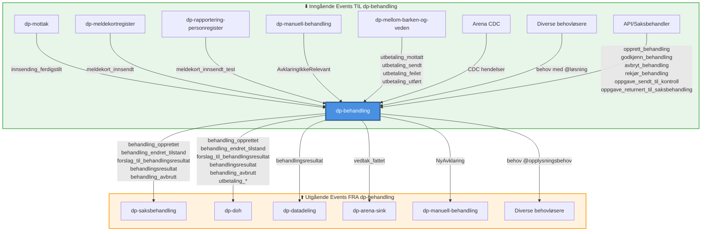

# Kafka Events Katalog for dp-behandling

Komplett oversikt over alle Kafka-eventer som dp-behandling konsumerer og produserer.

---

## Event Flow Diagram - Eksterne Events

Dette diagrammet viser kun eksterne events som dp-behandling sender og mottar (ikke interne events som går til seg selv).



### Event Flow Forklaring

**Inngående (konsumerer):**
- **dp-mottak**: Sender innsending_ferdigstilt når søknad er journalført
- **dp-meldekortregister**: Sender innsendte meldekort
- **dp-rapportering-personregister**: Sender testmeldekort
- **dp-manuell-behandling**: Informerer når avklaring ikke lenger er relevant
- **dp-mellom-barken-og-veden**: Sender utbetalingsstatus
- **Arena CDC**: Database-endringer fra Arena
- **Behovløsere**: Diverse apper som løser opplysningsbehov (dp-inntekt, dp-opplysninger, etc.)
- **API/Saksbehandler**: Kommandoer fra saksbehandlergrensesnitt

**Utgående (produserer):**
- **dp-saksbehandling**: Mottar behandlingsstatus og forslag til vedtak
- **dp-doh**: Overvåking av behandlinger og utbetalinger
- **dp-datadeling**: Lagrer behandlingsresultater
- **dp-arena-sink**: Sender vedtak til Arena
- **dp-manuell-behandling**: Mottar nye avklaringer som krever manuell vurdering
- **Behovløsere**: Publiserer behov for opplysninger som andre apper løser

---

## Del 1: Eventer dp-behandling lytter på (konsumerer)

### 1. `innsending_ferdigstilt`

**Type:** Hendelse om at innsending er fullført  
**Topic:** Sannsynligvis teamdagpenger rapid  
**Struktur:**
```json
{
  "@event_name": "innsending_ferdigstilt",
  "fødselsnummer": "string",
  "datoRegistrert": "LocalDateTime",
  "type": "NySøknad | Gjenopptak",
  "søknadsData": {
    "søknad_uuid": "UUID"
  },
  "fagsakId": "int",
  "journalpostId": "int"
}
```

**Produsent(er):**
- **[dp-mottak](https://github.com/navikt/dp-mottak)** - Journalfører og ferdigstiller innsendte søknader

**Konsument(er):**
- **[dp-behandling](https://github.com/navikt/dp-behandling)** - Transformerer til `søknad_behandlingsklar`
- **[dp-soknad](https://github.com/navikt/dp-soknad)** - Oppdaterer søknadsstatus
- **[dp-innsyn](https://github.com/navikt/dp-innsyn)** - Viser status til bruker
- **[dp-rapportering-personregister](https://github.com/navikt/dp-rapportering-personregister)** - Oppretter person
- **[dp-dataprodukter](https://github.com/navikt/dp-dataprodukter)** - Statistikk/dataprodukter
- **[dp-datadeling](https://github.com/navikt/dp-datadeling)** - Deler søknadsdata

**Beskrivelse:**  
Sendes når dp-mottak har ferdigstilt journalføring av søknad. dp-behandling transformerer dette til `søknad_behandlingsklar` som trigger behandling.

---

### 2. `søknad_behandlingsklar`

**Type:** Intern hendelse om at søknad er klar for behandling  
**Topic:** teamdagpenger rapid  
**Struktur:**
```json
{
  "@event_name": "søknad_behandlingsklar",
  "ident": "string",
  "søknadId": "UUID",
  "fagsakId": "int",
  "innsendt": "LocalDateTime",
  "journalpostId": "int",
  "type": "NySøknad | Gjenopptak"
}
```

**Produsent(er):**
- **[dp-behandling](https://github.com/navikt/dp-behandling)** - Transformerer `innsending_ferdigstilt` til dette

**Konsument(er):**
- **[dp-behandling](https://github.com/navikt/dp-behandling)** - SøknadInnsendtMottak håndterer og oppretter behandling

**Beskrivelse:**  
Internt event i dp-behandling som trigger opprettelse av behandling. Publiseres av InnsendingFerdigstiltMottak og konsumeres av SøknadInnsendtMottak.

---

### 3. `meldekort_innsendt`

**Type:** Hendelse om innsendt meldekort  
**Topic:** teamdagpenger rapid  
**Struktur:**
```json
{
  "@event_name": "meldekort_innsendt",
  "ident": "string",
  "id": "string",
  "periode": {
    "fraOgMed": "LocalDate",
    "tilOgMed": "LocalDate"
  },
  "kilde": {
    "rolle": "string",
    "ident": "string"
  },
  "dager": [
    {
      "dato": "LocalDate",
      "meldt": "boolean",
      "aktiviteter": [
        {
          "type": "Arbeid | Syk | Utdanning | Fravaer",
          "timer": "Duration?"
        }
      ]
    }
  ],
  "innsendtTidspunkt": "LocalDateTime",
  "originalMeldekortId": "string?",
  "meldedato": "LocalDate?",
  "kanSendesFra": "LocalDate?"
}
```

**Produsent(er):**
- **[dp-meldekortregister](https://github.com/navikt/dp-meldekortregister)** - Tar imot meldekort fra dp-rapportering

**Konsument(er):**
- **[dp-behandling](https://github.com/navikt/dp-behandling)** - Lagrer meldekort og venter på rettighetsperiode
- **[dp-doh](https://github.com/navikt/dp-doh)** - Overvåker korrigerte meldekort

**Beskrivelse:**  
Sendes når bruker har sendt inn meldekort. dp-behandling lagrer meldekortet og venter på at en behandling skal få rettighetsperiode før meldekortet behandles.

---

### 4. `meldekort_innsendt_test`

**Type:** Testdata for meldekort  
**Topic:** teamdagpenger rapid  
**Struktur:** Samme som `meldekort_innsendt`

**Produsent(er):**
- **[dp-rapportering-personregister](https://github.com/navikt/dp-rapportering-personregister)** - Publiserer testdata

**Konsument(er):**
- **[dp-behandling](https://github.com/navikt/dp-behandling)** - Behandler som vanlig meldekort

**Beskrivelse:**  
Testversjon av meldekort_innsendt for å teste meldekortbehandling uten produksjonsdata.

---

### 5. `behov` (med `@løsning`)

**Type:** Rapids & Rivers behov-løsning pattern  
**Topic:** teamdagpenger rapid  
**Struktur:**
```json
{
  "@event_name": "behov",
  "@final": true,
  "@opplysningsbehov": true,
  "ident": "string",
  "behandlingId": "UUID",
  "@løsning": {
    "<opplysningstype>": {
      "verdi": "any",
      "status": "Faktum | Hypotese",
      "gyldigFraOgMed": "LocalDate?",
      "gyldigTilOgMed": "LocalDate?",
      "@kilde": {
        "saksbehandler": "string",
        "begrunnelse": "string"
      }
    }
  },
  "@utledetAv": {
    "<opplysningstype>": ["UUID"]
  }
}
```

**Produsent(er):**
- **Diverse behovløsere i navikt:** Apper som løser opplysningsbehov (f.eks. inntekt, barn, etc.)

**Konsument(er):**
- **[dp-behandling](https://github.com/navikt/dp-behandling)** - OpplysningSvarMottak håndterer løsninger

**Beskrivelse:**  
Rapids & Rivers pattern for å løse datbehov. dp-behandling publiserer behov (se Del 2), og behovløsere svarer med `@løsning`. dp-behandling bruker `@opplysningsbehov=true` for å filtrere egne behov.

---

### 6. `FjernOpplysning` (behov med løsning)

**Type:** Behov om å fjerne en opplysning  
**Topic:** teamdagpenger rapid  
**Struktur:**
```json
{
  "@behov": ["FjernOpplysning"],
  "@final": true,
  "ident": "string",
  "behandlingId": "UUID",
  "opplysningId": "UUID",
  "behovId": "string"
}
```

**Produsent(er):**
- Ukjent (sannsynligvis intern i dp-behandling via regelmotor)

**Konsument(er):**
- **[dp-behandling](https://github.com/navikt/dp-behandling)** - FjernOpplysningMottak fjerner opplysning

**Beskrivelse:**  
Behov for å fjerne en eksisterende opplysning fra behandlingen.

---

### 7. `opprett_behandling`

**Type:** API-initiert hendelse for å opprette manuell behandling  
**Topic:** teamdagpenger rapid  
**Struktur:**
```json
{
  "@event_name": "opprett_behandling",
  "ident": "string",
  "prøvingsdato": "LocalDate?",
  "begrunnelse": "string?"
}
```

**Produsent(er):**
- **API-kall** - Sannsynligvis fra saksbehandlergrensesnitt (dp-saksbehandling eller lignende)

**Konsument(er):**
- **[dp-behandling](https://github.com/navikt/dp-behandling)** - OpprettBehandlingMottak oppretter behandling

**Beskrivelse:**  
Brukes for å opprette manuelle behandlinger utenfor normal søknadsflyt.

---

### 8. `godkjenn_behandling`

**Type:** Saksbehandlerhandling  
**Topic:** teamdagpenger rapid  
**Struktur:**
```json
{
  "@event_name": "godkjenn_behandling",
  "ident": "string",
  "behandlingId": "UUID"
}
```

**Produsent(er):**
- **API-kall** - Fra saksbehandlergrensesnitt

**Konsument(er):**
- **[dp-behandling](https://github.com/navikt/dp-behandling)** - GodkjennBehandlingMottak godkjenner behandling

**Beskrivelse:**  
Saksbehandler godkjenner behandlingsforslag. Trigger vedtaksfatting.

---

### 9. `avbryt_behandling`

**Type:** Hendelse om avbrutt behandling  
**Topic:** teamdagpenger rapid  
**Struktur:**
```json
{
  "@event_name": "avbryt_behandling",
  "ident": "string",
  "behandlingId": "UUID",
  "årsak": "string?"
}
```

**Produsent(er):**
- **[dp-behandling](https://github.com/navikt/dp-behandling)** - ArenaOppgaveMottak publiserer ved Arena-endringer
- **API-kall** - Saksbehandler kan avbryte behandling

**Konsument(er):**
- **[dp-behandling](https://github.com/navikt/dp-behandling)** - AvbrytBehandlingMottak avbryter behandling

**Beskrivelse:**  
Avbryter en pågående behandling. Kan trigges av Arena-oppgave endringer eller manuelt av saksbehandler.

---

### 10. `behandling_står_fast` (påminnelse)

**Type:** Påminnelse om behandling som ikke går videre  
**Topic:** teamdagpenger rapid  
**Struktur:**
```json
{
  "@event_name": "behandling_står_fast",
  "ident": "string",
  "behandlingId": "UUID"
}
```

**Produsent(er):**
- Ukjent (sannsynligvis intern scheduling/overvåkning)

**Konsument(er):**
- **[dp-behandling](https://github.com/navikt/dp-behandling)** - PåminnelseMottak håndterer

**Beskrivelse:**  
Sendes når en behandling står fast og ikke progrederer. Trigger re-evaluering av behandling.

---

### 11. `rekjør_behandling`

**Type:** Intern hendelse for å rekjøre behandling  
**Topic:** teamdagpenger rapid  
**Struktur:**
```json
{
  "@event_name": "rekjør_behandling",
  "ident": "string",
  "behandlingId": "UUID",
  "oppfriskOpplysningIder": ["UUID"]
}
```

**Produsent(er):**
- **API-kall** - Fra saksbehandlergrensesnitt eller administrativ grensesnitt

**Konsument(er):**
- **[dp-behandling](https://github.com/navikt/dp-behandling)** - RekjørBehandlingMottak rekjører behandling

**Beskrivelse:**  
Rekjører en behandling med mulighet for å oppdatere spesifikke opplysninger.

---

### 12. `beregn_meldekort`

**Type:** Intern hendelse for meldekortberegning  
**Topic:** teamdagpenger rapid  
**Struktur:**
```json
{
  "@event_name": "beregn_meldekort",
  "meldekortId": "UUID",
  "ident": "string"
}
```

**Produsent(er):**
- **[dp-behandling](https://github.com/navikt/dp-behandling)** - MeldekortBehandlingskø publiserer når meldekort er klart

**Konsument(er):**
- **[dp-behandling](https://github.com/navikt/dp-behandling)** - BeregnMeldekortMottak starter beregning

**Beskrivelse:**  
Intern event for å starte beregning av et meldekort når rettighetsperiode er etablert.

---

### 13. `AvklaringIkkeRelevant`

**Type:** Hendelse om at avklaring ikke lenger er relevant  
**Topic:** teamdagpenger rapid  
**Struktur:**
```json
{
  "@event_name": "AvklaringIkkeRelevant",
  "ident": "string",
  "avklaringId": "UUID",
  "kode": "string",
  "behandlingId": "UUID"
}
```

**Produsent(er):**
- **[dp-manuell-behandling](https://github.com/navikt/dp-manuell-behandling)** - Når saksbehandler løser avklaring

**Konsument(er):**
- **[dp-behandling](https://github.com/navikt/dp-behandling)** - AvklaringIkkeRelevantMottak lukker avklaring

**Beskrivelse:**  
Sendes når en avklaring ikke lenger er relevant (f.eks. løst eller ikke lenger aktuell).

---

### 14. `utbetaling_mottatt`, `utbetaling_sendt`, `utbetaling_feilet`, `utbetaling_utført`

**Type:** Statushendelser for utbetalinger  
**Topic:** teamdagpenger rapid  
**Struktur:**
```json
{
  "@event_name": "utbetaling_mottatt | utbetaling_sendt | utbetaling_feilet | utbetaling_utført",
  "ident": "string",
  "behandlingId": "UUID",
  "sakId": "int",
  "behandletHendelseId": "string",
  "status": "string"
}
```

**Produsent(er):**
- **[dp-mellom-barken-og-veden](https://github.com/navikt/dp-mellom-barken-og-veden)** - Integrasjon mot utbetalingssystem

**Konsument(er):**
- **[dp-behandling](https://github.com/navikt/dp-behandling)** - UtbetalingStatusMottak lagrer status
- **[dp-doh](https://github.com/navikt/dp-doh)** - Overvåker utbetalingsstatus

**Beskrivelse:**  
Livssyklusstatus for utbetalinger. Sender oppdateringer fra mottatt til utført/feilet.

---

### 15. `behandlingsresultat` / `behandling_avbrutt` (for meldekort)

**Type:** Behandlingsresultat for meldekortbehandling  
**Topic:** teamdagpenger rapid  
**Struktur:**
```json
{
  "@event_name": "behandlingsresultat | behandling_avbrutt",
  "behandlingId": "UUID",
  "behandletHendelse": {
    "type": "Meldekort",
    "id": "string"
  }
}
```

**Produsent(er):**
- **[dp-behandling](https://github.com/navikt/dp-behandling)** - PersonMediator publiserer behandlingsresultat

**Konsument(er):**
- **[dp-behandling](https://github.com/navikt/dp-behandling)** - MarkerMeldekortSomBehandletMottak markerer meldekort som ferdig

**Beskrivelse:**  
Internt event for å markere meldekort som ferdig behandlet.

---

### 16. `oppgave_sendt_til_kontroll`

**Type:** Oppgave sendt til beslutter  
**Topic:** teamdagpenger rapid  
**Struktur:**
```json
{
  "@event_name": "oppgave_sendt_til_kontroll",
  "ident": "string",
  "behandlingId": "UUID"
}
```

**Produsent(er):**
- **API-kall** - Fra saksbehandlergrensesnitt

**Konsument(er):**
- **[dp-behandling](https://github.com/navikt/dp-behandling)** - OppgaveSendtTilKontroll låser behandling

**Beskrivelse:**  
Låser behandling når saksbehandler sender til beslutter for kontroll.

---

### 17. `oppgave_returnert_til_saksbehandling`

**Type:** Oppgave returnert fra beslutter  
**Topic:** teamdagpenger rapid  
**Struktur:**
```json
{
  "@event_name": "oppgave_returnert_til_saksbehandling",
  "ident": "string",
  "behandlingId": "UUID"
}
```

**Produsent(er):**
- **API-kall** - Fra besluttergrensesnitt

**Konsument(er):**
- **[dp-behandling](https://github.com/navikt/dp-behandling)** - OppgaveReturnertTilSaksbehandler låser opp behandling

**Beskrivelse:**  
Låser opp behandling når beslutter returnerer til saksbehandler.

---

### 18. Arena CDC hendelser (Change Data Capture)

**Type:** Database-endringer fra Arena  
**Topic:** Sannsynligvis Arena CDC topic  
**Struktur:**
```json
{
  "op_type": "U",
  "pos": "string",
  "op_ts": "Arena timestamp",
  "after": {
    "SAK_ID": "int",
    "DESCRIPTION": "string",
    "OPPGAVETYPE_BESKRIVELSE": "string",
    "ENDRET_AV": "string",
    "USERNAME": "string",
    "REG_DATO": "Arena timestamp",
    "MOD_DATO": "Arena timestamp"
  },
  "before": {
    "USERNAME": "string"
  }
}
```

**Produsent(er):**
- **Arena** - Database change data capture

**Konsument(er):**
- **[dp-behandling](https://github.com/navikt/dp-behandling)** - ArenaOppgaveMottak avbryter behandling ved oppgaveendring

**Beskrivelse:**  
Lytter på Arena-oppgaver. Avbryter behandling hvis oppgave i Arena endres (tildeles saksbehandler).

---

## Del 2: Eventer dp-behandling sender ut (produserer)

### 1. `søknad_behandlingsklar`

**Type:** Transformert søknadshendelse  
**Topic:** teamdagpenger rapid

Se Del 1 #2 for detaljer.

**Produsent:** dp-behandling (InnsendingFerdigstiltMottak)  
**Konsument:** dp-behandling (SøknadInnsendtMottak)

**Beskrivelse:**  
dp-behandling mottar `innsending_ferdigstilt`, transformerer og republiserer som `søknad_behandlingsklar`.

---

### 2. `behandling_opprettet`

**Type:** Hendelse om opprettet behandling  
**Topic:** teamdagpenger rapid  
**Struktur:**
```json
{
  "@event_name": "behandling_opprettet",
  "ident": "string",
  "behandlingId": "UUID",
  "basertPåBehandlinger": ["UUID"],
  "behandlingskjedeId": "UUID",
  "behandletHendelse": {
    "id": "string",
    "datatype": "string",
    "type": "Meldekort | Søknad | Manuell",
    "skjedde": "LocalDateTime"
  },
  "basertPåBehandling": "UUID?"
}
```

**Produsent:**
- **[dp-behandling](https://github.com/navikt/dp-behandling)** - PersonMediator publiserer

**Konsument(er):**
- **[dp-saksbehandling](https://github.com/navikt/dp-saksbehandling)** - Oppretter oppgave
- **[dp-doh](https://github.com/navikt/dp-doh)** - Overvåking

**Beskrivelse:**  
Publiseres når en ny behandling opprettes i dp-behandling.

---

### 3. `behandling_endret_tilstand`

**Type:** Tilstandsendring i behandling  
**Topic:** teamdagpenger rapid  
**Struktur:**
```json
{
  "@event_name": "behandling_endret_tilstand",
  "ident": "string",
  "behandlingId": "UUID",
  "forrigeTilstand": "string",
  "gjeldendeTilstand": "string",
  "forventetFerdig": "LocalDateTime",
  "tidBrukt": "Duration"
}
```

**Produsent:**
- **[dp-behandling](https://github.com/navikt/dp-behandling)** - PersonMediator publiserer

**Konsument(er):**
- Sannsynligvis dp-saksbehandling og overvåkningsverktøy

**Beskrivelse:**  
Publiseres hver gang behandlingen endrer tilstand (f.eks. fra UnderBehandling til UnderBeslutning).

---

### 4. `forslag_til_behandlingsresultat`

**Type:** Behandlingsforslag klar  
**Topic:** teamdagpenger rapid  
**Struktur:**
```json
{
  "@event_name": "forslag_til_behandlingsresultat",
  "ident": "string",
  "behandlingId": "UUID",
  "behandletHendelse": { /* ... */ },
  "utfall": [ /* array of utfall */ ],
  "rettighetsperioder": [ /* array of perioder */ ],
  "opplysninger": [ /* array of opplysninger */ ],
  "avklaringer": [ /* array of avklaringer */ ]
}
```

**Produsent:**
- **[dp-behandling](https://github.com/navikt/dp-behandling)** - PersonMediator publiserer ved ForslagTilVedtak

**Konsument(er):**
- **[dp-saksbehandling](https://github.com/navikt/dp-saksbehandling)** - Viser forslag til saksbehandler
- **[dp-doh](https://github.com/navikt/dp-doh)** - Overvåking

**Beskrivelse:**  
Publiseres når regelmotor har beregnet et forslag til vedtak som må vurderes av saksbehandler.

---

### 5. `behandlingsresultat`

**Type:** Endelig behandlingsresultat  
**Topic:** teamdagpenger rapid  
**Struktur:**
```json
{
  "@event_name": "behandlingsresultat",
  "ident": "string",
  "behandlingId": "UUID",
  "behandletHendelse": { /* ... */ },
  "utfall": [ /* array of utfall */ ],
  "rettighetsperioder": [ /* array of perioder */ ],
  "opplysninger": [ /* array of opplysninger */ ],
  "avklaringer": [ /* array of avklaringer */ ]
}
```

**Produsent:**
- **[dp-behandling](https://github.com/navikt/dp-behandling)** - PersonMediator publiserer ved BehandlingFerdig

**Konsument(er):**
- **[dp-saksbehandling](https://github.com/navikt/dp-saksbehandling)** - Oppdaterer behandlingsstatus
- **[dp-doh](https://github.com/navikt/dp-doh)** - Overvåking
- **[dp-datadeling](https://github.com/navikt/dp-datadeling)** - Lagrer behandlingsresultat

**Beskrivelse:**  
Publiseres når behandling er ferdig (vedtak fattet). Inneholder komplett behandlingsresultat.

---

### 6. `behandling_avbrutt`

**Type:** Avbrutt behandling  
**Topic:** teamdagpenger rapid  
**Struktur:**
```json
{
  "@event_name": "behandling_avbrutt",
  "ident": "string",
  "behandlingId": "UUID",
  "behandletHendelse": {
    "id": "string",
    "datatype": "string",
    "type": "Meldekort | Søknad | Manuell"
  },
  "årsak": "string?"
}
```

**Produsent:**
- **[dp-behandling](https://github.com/navikt/dp-behandling)** - PersonMediator publiserer

**Konsument(er):**
- **[dp-saksbehandling](https://github.com/navikt/dp-saksbehandling)** - Oppdaterer status
- **[dp-doh](https://github.com/navikt/dp-doh)** - Overvåking

**Beskrivelse:**  
Publiseres når en behandling avbrytes (f.eks. ved Arena-oppgaveendring).

---

### 7. `vedtak_fattet`

**Type:** Vedtak er fattet (kun ved avslag)  
**Topic:** teamdagpenger rapid  
**Struktur:**
```json
{
  "@event_name": "vedtak_fattet",
  "ident": "string",
  "behandlingId": "UUID",
  "vedtak": { /* vedtak detaljer */ }
}
```

**Produsent:**
- **[dp-behandling](https://github.com/navikt/dp-behandling)** - PersonMediator publiserer kun ved enkelt avslag

**Konsument(er):**
- **[dp-arena-sink](https://github.com/navikt/dp-arena-sink)** - Sender vedtak til Arena
- **[dp-doh](https://github.com/navikt/dp-doh)** - Overvåking

**Beskrivelse:**  
Publiseres kun når behandling har ett enkelt avslagsresultat. Brukes sannsynligvis for integrasjon mot andre systemer.

---

### 8. `avklaring_lukket`

**Type:** Avklaring er lukket/løst  
**Topic:** teamdagpenger rapid  
**Struktur:**
```json
{
  "@event_name": "avklaring_lukket",
  "ident": "string",
  "behandlingId": "UUID",
  "avklaringId": "UUID",
  "kode": "string"
}
```

**Produsent:**
- **[dp-behandling](https://github.com/navikt/dp-behandling)** - PersonMediator publiserer

**Konsument(er):**
- Ingen funnet (sannsynligvis brukt til overvåking/logging)

**Beskrivelse:**  
Publiseres når en avklaring lukkes (løses eller blir irrelevant).

---

### 9. `NyAvklaring`

**Type:** Ny avklaring opprettet  
**Topic:** teamdagpenger rapid  
**Struktur:**
```json
{
  "@event_name": "NyAvklaring",
  "ident": "string",
  "avklaringId": "UUID",
  "kode": "string",
  "behandlingId": "UUID",
  "søknadId": "UUID?"
}
```

**Produsent:**
- **[dp-behandling](https://github.com/navikt/dp-behandling)** - AvklaringKafkaObservatør publiserer

**Konsument(er):**
- **[dp-manuell-behandling](https://github.com/navikt/dp-manuell-behandling)** - Lytter og presenterer for saksbehandler

**Beskrivelse:**  
Publiseres når regelmotor oppretter en ny avklaring som krever manuell vurdering.

---

### 10. `beregn_meldekort`

**Type:** Intern trigger for meldekortberegning  
**Topic:** teamdagpenger rapid

Se Del 1 #12 for detaljer.

**Produsent:** dp-behandling (MeldekortBehandlingskø)  
**Konsument:** dp-behandling (BeregnMeldekortMottak)

**Beskrivelse:**  
Intern event publisert av MeldekortBehandlingskø når meldekort er klart for beregning.

---

### 11. `avbryt_behandling`

**Type:** Avbryt behandling kommando  
**Topic:** teamdagpenger rapid

Se Del 1 #9 for detaljer.

**Produsent:** dp-behandling (ArenaOppgaveMottak)  
**Konsument:** dp-behandling (AvbrytBehandlingMottak)

**Beskrivelse:**  
dp-behandling kan publisere dette når Arena-oppgave endres for å avbryte egen behandling.

---

### 12. Behov (Rapids & Rivers pattern)

**Type:** Datbehov for opplysninger  
**Topic:** teamdagpenger rapid  
**Struktur:**
```json
{
  "@event_name": "behov",
  "@behov": ["<opplysningstype1>", "<opplysningstype2>"],
  "@opplysningsbehov": true,
  "@final": true,
  "ident": "string",
  "behandlingId": "UUID",
  "<opplysningstype1>": {
    /* behov-spesifikke detaljer */
  },
  "@utledetAv": {
    "<opplysningstype1>": ["UUID"],
    "<opplysningstype2>": ["UUID"]
  }
}
```

**Produsent:**
- **[dp-behandling](https://github.com/navikt/dp-behandling)** - BehovMediator publiserer

**Konsument(er):**
- **Diverse behovløsere** - Apper som løser spesifikke opplysningstyper

**Eksempler på opplysningstyper:**
- Inntekt (fra dp-inntekt)
- Arbeidsforhold (fra dp-opplysninger)
- Barn (fra PDL via dp-opplysninger)
- Verneplikt (fra dp-opplysninger)
- Sykepenger (fra dp-opplysninger)
- mv.

**Beskrivelse:**  
Publiserer behov for opplysninger som regelmotor trenger for å vurdere rettighet. Bruker `@opplysningsbehov=true` for å skille fra andre behovstyper. Behovløsere svarer med `@løsning` i behovet.

---

### 13. Aktivitetslogg hendelser

**Type:** Diverse logg/aktivitetshendelser  
**Topic:** teamdagpenger rapid  
**Struktur:**
```json
{
  "@event_name": "<dynamisk event navn>",
  /* dynamisk innhold basert på aktivitetslogg */
}
```

**Produsent:**
- **[dp-behandling](https://github.com/navikt/dp-behandling)** - AktivitetsloggMediator publiserer

**Konsument(er):**
- Ukjent (sannsynligvis logging/overvåkningssystemer)

**Beskrivelse:**  
AktivitetsloggMediator mapper aktivitetslogg til Kafka-events. Innhold og struktur varierer basert på aktivitetsloggen.

---

## Oppsummering

### Eventer dp-behandling konsumerer:
1. `innsending_ferdigstilt` - fra dp-mottak
2. `søknad_behandlingsklar` - fra seg selv (intern)
3. `meldekort_innsendt` - fra dp-meldekortregister
4. `meldekort_innsendt_test` - fra dp-rapportering-personregister
5. `behov` med `@løsning` - fra diverse behovløsere
6. `FjernOpplysning` behov - intern
7. `opprett_behandling` - fra API
8. `godkjenn_behandling` - fra API
9. `avbryt_behandling` - fra seg selv og API
10. `behandling_står_fast` - intern påminnelse
11. `rekjør_behandling` - fra API
12. `beregn_meldekort` - fra seg selv (intern)
13. `AvklaringIkkeRelevant` - fra dp-manuell-behandling
14. `utbetaling_*` (4 varianter) - fra dp-mellom-barken-og-veden
15. `behandlingsresultat`/`behandling_avbrutt` - fra seg selv (intern)
16. `oppgave_sendt_til_kontroll` - fra API
17. `oppgave_returnert_til_saksbehandling` - fra API
18. Arena CDC hendelser - fra Arena

### Eventer dp-behandling produserer:
1. `søknad_behandlingsklar` - internt event
2. `behandling_opprettet` - til dp-saksbehandling
3. `behandling_endret_tilstand` - til dp-saksbehandling
4. `forslag_til_behandlingsresultat` - til dp-saksbehandling
5. `behandlingsresultat` - til dp-saksbehandling, dp-datadeling
6. `behandling_avbrutt` - til dp-saksbehandling
7. `vedtak_fattet` - til eksterne systemer
8. `avklaring_lukket` - logging
9. `NyAvklaring` - til dp-manuell-behandling
10. `beregn_meldekort` - internt event
11. `avbryt_behandling` - internt event
12. Behov (`@event_name=behov`) - til behovløsere
13. Aktivitetslogg hendelser - til logging/overvåkning

### Topic(er):
- Primært: **teamdagpenger rapid** (Rapids & Rivers topic)
- Arena CDC: Separat topic for Arena database changes

### Arkitektur:
dp-behandling følger Rapids & Rivers mønsteret og fungerer som:
- **Behovspubliserer**: Publiserer behov for opplysninger
- **Behovsløser**: Løser enkelte behov (som FjernOpplysning)
- **Hendelsesprodusent**: Publiserer hendelser om behandlingsflyt
- **Hendelseskonsument**: Konsumerer hendelser fra hele dagpenger-domenet
- **Transformer**: Transformerer mellom event-formater (innsending_ferdigstilt → søknad_behandlingsklar)
