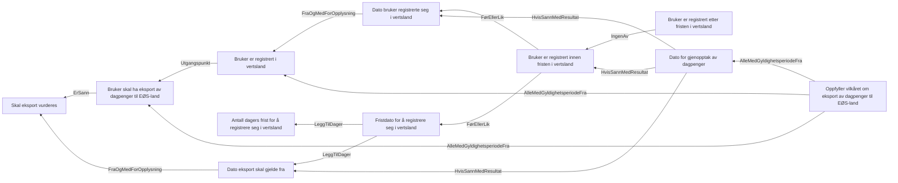

# Eksport av dagpenger til EØS-land

## Regeltre



## Akseptansetester

```gherkin
#language: no
@dokumentasjon @regel-eksport
Egenskap: Eksport av dagpenger til EØS-land

  Scenario: Søker oppfyller vilkåret om eksport når registrering skjer innen fristen
    Gitt at eksport av dagpenger skal vurderes fra "01.02.2025"
    Og at personen registrerer seg i vertslandet "05.02.2025"
    Så skal vilkåret om eksport være oppfylt fra og med "01.02.2025"

  Scenario: Søker oppfyller vilkåret om eksport når registrering skjer etter fristen
    Gitt at eksport av dagpenger skal vurderes fra "01.02.2025"
    Og at personen registrerer seg i vertslandet "15.02.2025"
    Så skal vilkåret om eksport være oppfylt fra og med "15.02.2025"

  Scenario: Søker oppfyller ikke vilkåret om eksport uten registrering i vertslandet
    Gitt at eksport av dagpenger skal vurderes fra "01.02.2025"
    Så skal vilkåret om eksport ikke være oppfylt
``` 