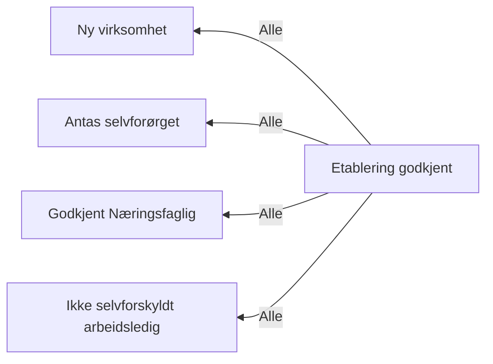

# Etablering

## Regeltre



## Akseptansetester

```gherkin
#language: no
@dokumentasjon @regel-etablering
Egenskap: Etablering

  Scenariomal: Saksbehandler vurderer opplysninger om etablering
    Gitt at etablering skal vurderes
    Og de øvrige vilkårene for etablering er oppfylt
    Og saksbehandler vurderer at etablering påvirker resultatet "<påvirkerResultat>"
    Og saksbehandler vurderer at det er en ny virksomhet "<nyVirksomhet>"
    Og saksbehandler vurderer selvforsørgelse som "<selvforsørget>"
    Så skal vilkåret om etablering være "<utfall>"
    Og skal retten til dagpenger være "<harRett>"

    Eksempler:
      | påvirkerResultat | nyVirksomhet | selvforsørget | utfall | harRett |
      | Ja               | Ja           | Ja             | Ja     | Ja      |
      | Ja               | Ja           | Nei            | Nei    | Nei     |
      | Ja               | Nei          | Ja             | Nei    | Nei     |
      | Ja               | Nei          | Nei            | Nei    | Nei     |
      | Nei              | Ja           | Ja             | Ja     | Ja      |
      | Nei              | Ja           | Nei            | Nei    | Ja      |
      | Nei              | Nei          | Ja             | Nei    | Ja      |
      | Nei              | Nei          | Nei            | Nei    | Ja      |

  Scenario: Etablering skal ikke vurderes
    Gitt at etablering ikke skal vurderes
    Så skal opplysninger om etablering ikke være satt
    Og skal retten til dagpenger være "Ja"
``` 
