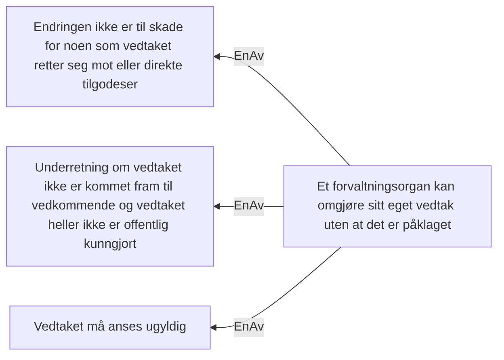

# Forvaltningsloven § 35 1. ledd, Et forvaltningsorgan kan omgjøre sitt eget vedtak uten at det er påklaget

## Regeltre



## Akseptansetester

```gherkin
#language: no
@dokumentasjon @regel-omgjøring-uten-klage
Egenskap: Forvaltningsloven § 35 1. ledd, Et forvaltningsorgan kan omgjøre sitt eget vedtak uten at det er påklaget

  Scenariomal: # Enter scenario name here
    Gitt at vi har startet en omgjøringsprosess
    Og endringen ikke er til skade for noen som vedtaket <retter seg mot eller direkte tilgodeser>
    Og <underretning> om vedtaket ikke er kommet fram til vedkommende og vedtaket heller ikke er offentlig kunngjort
    Og vedtaket må anses <ugyldig>
    Så kan forvaltningsorgan <omgjøre> sitt eget vedtak uten at det er påklaget
    Eksempler:
      | retter seg mot eller direkte tilgodeser | underretning | ugyldig | omgjøre |
      | Nei                                     | Ja           | Ja      | Ja      |
      | Nei                                     | Ja           | Nei     | Ja      |
      | Nei                                     | Nei          | Ja      | Ja      |
      | Nei                                     | Nei          | Nei     | Nei     |
      | Ja                                      | Ja           | Ja      | Ja      |
      | Ja                                      | Ja           | Nei     | Ja      |
      | Ja                                      | Nei          | Ja      | Ja      |
      | Ja                                      | Ja           | Nei     | Ja      |
``` 