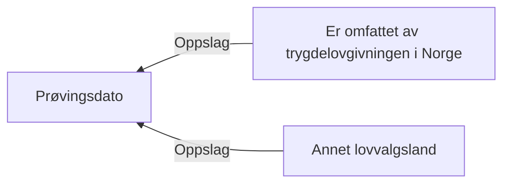

# § 4-1 a. Lovvalg

## Regeltre



## Akseptansetester

```gherkin
#language: no
@dokumentasjon @regel-lovvalg
Egenskap: § 4-1 a. Lovvalg

  Scenario: Søker oppfyller § 4-1 a. Lovvalg
    Gitt at søker har søkt om dagpenger
    Og personen omfattet av trygdelovgivningen i Norge
    Så skal vilkåret om lovvalg være oppfylt

  Scenariomal: Søker ikke oppfyller § 4-1 a. Lovvalg
    Gitt at søker har søkt om dagpenger
    Og personen omfattes ikke av trygdelovgivningen i Norge
    Og saksbehandler har begrunnet med "<begrunnelse>"
    Så skal vilkåret om lovvalg være ikke oppfylt
    Og begrunnelsen er "<begrunnelse>"

    Eksempler:
      | begrunnelse    |
      | Tyskland       |
      | Thinking about |
``` 