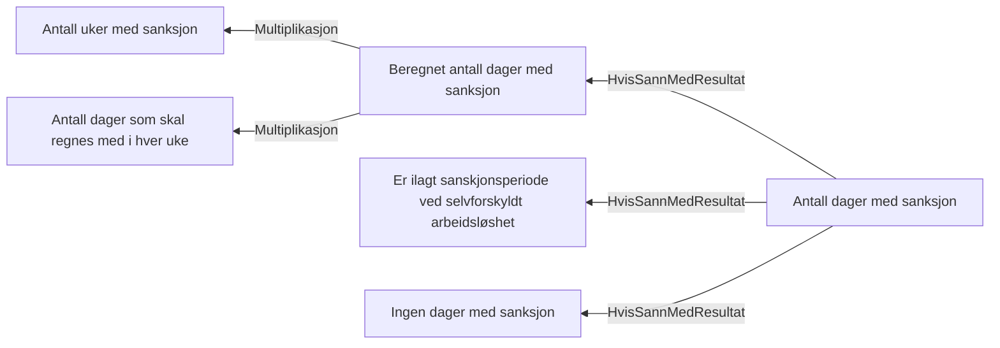

# § 4-10 Sanksjonsperiode ved selvforskyldt arbeidsløshet

## Regeltre



## Akseptansetester

```gherkin
#language: no
@dokumentasjon @regel-sanksjon
Egenskap: § 4-10 Sanksjonsperiode ved selvforskyldt arbeidsløshet

  Scenario: Ingen sanksjon gir ingen sanksjonsdager
    Gitt at søker har søkt om dagpenger for vurdering av sanksjon
    Og saksbehandler ilegger ikke sanksjon
    Så skal antall sanksjonsdager være "0"

  Scenario: Sanksjon med standard antall uker gir 90 sanksjonsdager
    Gitt at søker har søkt om dagpenger for vurdering av sanksjon
    Og saksbehandler ilegger sanksjon
    Så skal antall sanksjonsdager være "90"

  Scenariomal: Antall sanksjonsdager beregnes ut fra antall sanksjonsuker
    Gitt at søker har søkt om dagpenger for vurdering av sanksjon
    Og saksbehandler ilegger sanksjon i "<uker>" uker
    Så skal antall sanksjonsdager være "<dager>"
  Eksempler:
    | uker | dager |
    | 18   | 90    |
    | 6    | 30    |
    | 1    | 5     |
``` 