# § 4-12. Dagpengenes størrelse

## Regeltre

```mermaid
graph RL
  A["Barn"] -->|"Ekstern"| B["søknadId"]
  A["Barn"] -->|"Ekstern"| C["Søknadsdato"]
  D["Antall barn som gir rett til barnetillegg"] -->|"AntallAv"| A["Barn"]
  E["Faktor for utregning av dagsats etter dagpengegrunnlaget"] -->|"Oppslag"| F["Prøvingsdato"]
  G["Dagsats uten barnetillegg før samordning"] -->|"Multiplikasjon"| H["Dagpengegrunnlag"]
  G["Dagsats uten barnetillegg før samordning"] -->|"Multiplikasjon"| E["Faktor for utregning av dagsats etter dagpengegrunnlaget"]
  I["Dagsats uten barnetillegg før samordning"] -->|"Avrund"| G["Dagsats uten barnetillegg før samordning"]
  J["Barnetilleggets størrelse i kroner per dag for hvert barn"] -->|"Oppslag"| F["Prøvingsdato"]
  K["Sum av barnetillegg"] -->|"Multiplikasjon"| J["Barnetilleggets størrelse i kroner per dag for hvert barn"]
  K["Sum av barnetillegg"] -->|"Multiplikasjon"| D["Antall barn som gir rett til barnetillegg"]
  L["Dagsats med barnetillegg før samordning"] -->|"Addisjon"| I["Dagsats uten barnetillegg før samordning"]
  L["Dagsats med barnetillegg før samordning"] -->|"Addisjon"| K["Sum av barnetillegg"]
  M["Avrundet ukessats med barnetillegg før samordning"] -->|"Multiplikasjon"| L["Dagsats med barnetillegg før samordning"]
  M["Avrundet ukessats med barnetillegg før samordning"] -->|"Multiplikasjon"| N["Antall arbeidsdager per uke"]
  O["90% av grunnlag for dagpenger"] -->|"Oppslag"| F["Prøvingsdato"]
  P["Antall arbeidsdager per år"] -->|"Oppslag"| F["Prøvingsdato"]
  Q["Maksimalt mulig grunnlag avgrenset til 90% av dagpengegrunnlaget"] -->|"Multiplikasjon"| H["Dagpengegrunnlag"]
  Q["Maksimalt mulig grunnlag avgrenset til 90% av dagpengegrunnlaget"] -->|"Multiplikasjon"| O["90% av grunnlag for dagpenger"]
  R["Maksimal mulig dagsats avgrenset til 90% av dagpengegrunnlaget"] -->|"Divisjon"| Q["Maksimalt mulig grunnlag avgrenset til 90% av dagpengegrunnlaget"]
  R["Maksimal mulig dagsats avgrenset til 90% av dagpengegrunnlaget"] -->|"Divisjon"| P["Antall arbeidsdager per år"]
  S["Avrundet maksimal mulig dagsats avgrenset til 90% av dagpengegrunnlaget"] -->|"Avrund"| R["Maksimal mulig dagsats avgrenset til 90% av dagpengegrunnlaget"]
  T["Andel av dagsats med barnetillegg som overstiger maks andel av dagpengegrunnlaget"] -->|"Substraksjon"| L["Dagsats med barnetillegg før samordning"]
  T["Andel av dagsats med barnetillegg som overstiger maks andel av dagpengegrunnlaget"] -->|"Substraksjon"| S["Avrundet maksimal mulig dagsats avgrenset til 90% av dagpengegrunnlaget"]
  U["Andel av dagsats uten barnetillegg avkortet til maks andel av dagpengegrunnlaget"] -->|"Substraksjon"| I["Dagsats uten barnetillegg før samordning"]
  U["Andel av dagsats uten barnetillegg avkortet til maks andel av dagpengegrunnlaget"] -->|"Substraksjon"| T["Andel av dagsats med barnetillegg som overstiger maks andel av dagpengegrunnlaget"]
  V["Samordnet dagsats med barnetillegg"] -->|"Addisjon"| W["Dagsats uten barnetillegg samordnet"]
  V["Samordnet dagsats med barnetillegg"] -->|"Addisjon"| K["Sum av barnetillegg"]
  X["Dagsats med barnetillegg etter samordning og 90 % regel"] -->|"MinstAv"| V["Samordnet dagsats med barnetillegg"]
  X["Dagsats med barnetillegg etter samordning og 90 % regel"] -->|"MinstAv"| S["Avrundet maksimal mulig dagsats avgrenset til 90% av dagpengegrunnlaget"]
  Y["Har samordnet"] -->|"ErUlik"| U["Andel av dagsats uten barnetillegg avkortet til maks andel av dagpengegrunnlaget"]
  Y["Har samordnet"] -->|"ErUlik"| W["Dagsats uten barnetillegg samordnet"]
  N["Antall arbeidsdager per uke"] -->|"Oppslag"| F["Prøvingsdato"]
  Z["Ukessats med barnetillegg etter samordning"] -->|"Multiplikasjon"| X["Dagsats med barnetillegg etter samordning og 90 % regel"]
  Z["Ukessats med barnetillegg etter samordning"] -->|"Multiplikasjon"| N["Antall arbeidsdager per uke"]
  AA["Har barnetillegg"] -->|"StørreEnnEllerLik"| K["Sum av barnetillegg"]
  AA["Har barnetillegg"] -->|"StørreEnnEllerLik"| J["Barnetilleggets størrelse i kroner per dag for hvert barn"]
```



## Akseptansetester

```gherkin
#language: no
@dokumentasjon @regel-dagpengensStørrelse
Egenskap: § 4-12. Dagpengenes størrelse

  Scenario: Dagpengegrunnlag og søker har ikke barn
    Gitt at dagpengegrunnlag er "246131"
    Og at søker har ikke barn
    Så skal dagpengens uavrundet størrelse uten barnetillegg være "590.7144"
    Så skal dagpengens størrelse være "591"

  Scenario: Dagpengegrunnlag og søker har 2 barn
    Gitt at dagpengegrunnlag er "246131"
    Og at søker har 2 barn
    Så skal dagpengens uavrundet størrelse uten barnetillegg være "590.7144"
    Så skal dagpengens størrelse være "663"

  Scenario: Dagpengegrunnlag og mange barn gjør at 90% regelen blir brukt
    Gitt at dagpengegrunnlag er "70001"
    Og at søker har 7 barn
    Så skal dagpengens uavrundet størrelse uten barnetillegg være "168.0024"
    Så skal dagpengens størrelse være "242"
    Så skal ukessats være "1210"
``` 