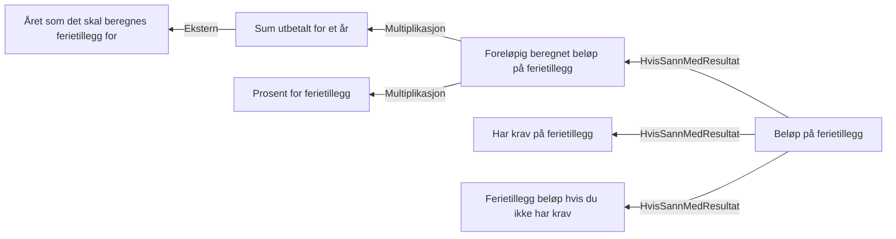

# § 4-14. Ferietillegg

## Regeltre



## Akseptansetester

```gherkin
#language: no
Egenskap: § 4-14. Ferietillegg

  @dokumentasjon @regel-ferietillegg-krav
  Scenario: Ferietillegg kan innvilges når det er forbrukt nok dager
    Gitt at søker har forbrukt 10 dager
    Så har søker ikke krav på ferietillegg

  @dokumentasjon @regel-ferietillegg-belop
  Scenario: Ferietillegg beregner riktig beløp
    Gitt at søker har forbrukt 100 dager
    Og at søker har utbetalt "500000" kroner i opptjeningsåret
    Så er ferietillegget "47500" kroner

  @dokumentasjon @regel-ferietillegg-belop
  Scenario: Ferietillegg beregner riktig beløp med tall med mange desimaler
    Gitt at søker har forbrukt 100 dager
    Og at søker har utbetalt "5442459.5555" kroner i opptjeningsåret
    # todo: Dette beløpet må avrundes!
    Så er ferietillegget "517033.6577725" kroner
``` 