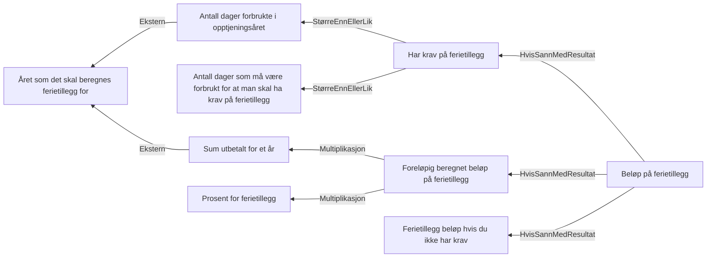

# § 4-14. Ferietillegg

## Regeltre



## Akseptansetester

```gherkin
#language: no
@dokumentasjon @regel-ferietillegg-krav
Egenskap: § 4-14. Ferietillegg

  Scenariomal: Ferietillegg kan innvilges når det er forbrukt nok dager
    Gitt at søker har forbrukt <antall dager> dager
    Og at søker har utbetalt <penger> kroner i opptjeningsåret
    Så har søker <krav på ferietillegg>
    Så er ferietillegget <utbetalt> kroner
    Eksempler:
      | antall dager | krav på ferietillegg | penger         | utbetalt         |
      | 100          | Ja                   | "500000"       | "47500"          |
      | 41           | Ja                   | "5442459.5555" | "517033.6577725" |
      | 40           | Nei                  | "10000"        | "0"              |
      | 10           | Nei                  | "0"            | "0"              |
``` 