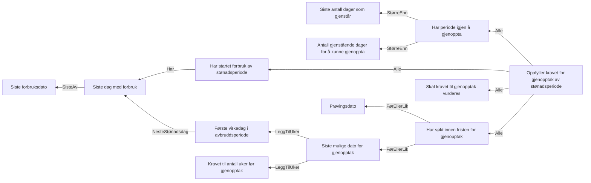

# § 4-16. Gjenopptak av løpende stønadsperiode som er avbrutt

## Regeltre



## Akseptansetester

```gherkin
#language: no
@dokumentasjon @regel-gjenopptak
Egenskap: § 4-16. Gjenopptak av løpende stønadsperiode som er avbrutt

  Scenariomal: Søker gjenopptak
    Gitt at søkeren har hatt en løpende stønadsperiode og har hatt minst en forbruksdag på <siste forbruksdag>
    Og søker etter gjenopptak på <gjenopptaksprøvingsdato>
    Og har vært i <arbeid i 12 uker eller mer> etter siste forbruksdag
    Så skal gjenopptak være <gjenopptas>
    Så skal reberegnes være <reberegnes>

    Eksempler:
      | siste forbruksdag | gjenopptaksprøvingsdato | gjenopptas | arbeid i 12 uker eller mer | reberegnes |
      | 01.04.2022        | 01.05.2022              | Ja         | Ja                         | Ja         |
      | 01.04.2022        | 01.05.2022              | Ja         | Nei                        | Nei        |
      | 01.04.2020        | 01.05.2022              | Nei        | Nei                        | Nei        |
``` 