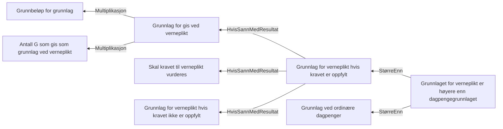

# § 4-19 Verneplikt (fastsetting)

## Regeltre



## Akseptansetester

```gherkin
#language: no
@dokumentasjon @regel-verneplikt-fastsetting
Egenskap: § 4-19 Verneplikt (fastsetting)

  Scenariomal: Gitt at søker oppfyller kravet verneplikt
    Gitt at kravet til verneplikt er "<Verneplikt>"
    Og at inntekt ved verneplikt er
      | Siste 12 måneder | <Siste 12 måneder> |
      | Siste 36 måneder | <Siste 36 måneder> |
    Så skal grunnlag være "<grunnlag>"
    Og dagpengerperioden være <dagpengeperiode> uker
    Og vernepliktperioden være <vernepliktperiode> uker

    Eksempler:
      | Verneplikt | Siste 12 måneder | Siste 36 måneder | dagpengeperiode | vernepliktperiode | grunnlag |
      | Nei        | 0                | 0                | 0               | 0                 | 0        |
      | Nei        | 118620           | 0                | 0               | 0                 | 118620   |
      | Nei        | 0                | 284688           | 0               | 0                 | 284688   |
      | Nei        | 177930           | 0                | 52              | 0                 | 177930   |
      | Nei        | 0                | 355860           | 52              | 0                 | 355860   |
      | Nei        | 477930           | 0                | 104             | 0                 | 477930   |
      | Ja         | 0                | 0                | 0               | 26                | 334431   |
      | Ja         | 177930           | 0                | 52              | 26                | 334431   |
      | Ja         | 477930           | 0                | 104             | 26                | 477930   |
``` 