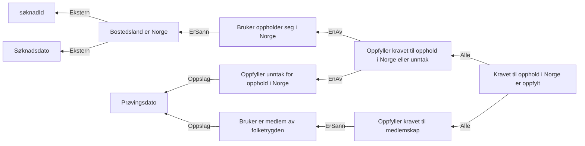

# § 4-2. Opphold i Norge

## Regeltre



## Akseptansetester

```gherkin
#language: no
@dokumentasjon @regel-opphold
Egenskap: § 4-2. Opphold i Norge

  Bakgrunn:
    Gitt at søknadsdatos er "01.04.2022"

  Scenario: Søker oppfyller § 4-2. Opphold i Norge
    Gitt at personen oppholder seg i Norge
    Så skal vilkåret om opphold i Norge være oppfylt

  Scenario: Søker oppfyller ikke § 4-2. Opphold i Norge
    Gitt at personen oppholder seg ikke i Norge
    Så skal vilkåret om opphold i Norge ikke være oppfylt

  Scenario: Søker oppfyller § 4-2. Opphold i Norge via ett av unntakene
    Gitt at personen oppholder seg ikke i Norge
    Men at personen oppfyller ett unntak for opphold
    Så skal vilkåret om opphold i Norge være oppfylt

  Scenariomal: Søker oppfyller § 4-2. Medlemskap
    Gitt at søker har søkt om dagpenger og er medlem?
    Og at personen er medlem "<svar>" i folketrygden
    Så skal vilkåret om medlemskap være "<utfall>"

    Eksempler:
      | svar | utfall |
      | ja   | ja     |
      | nei  | nei    |
``` 