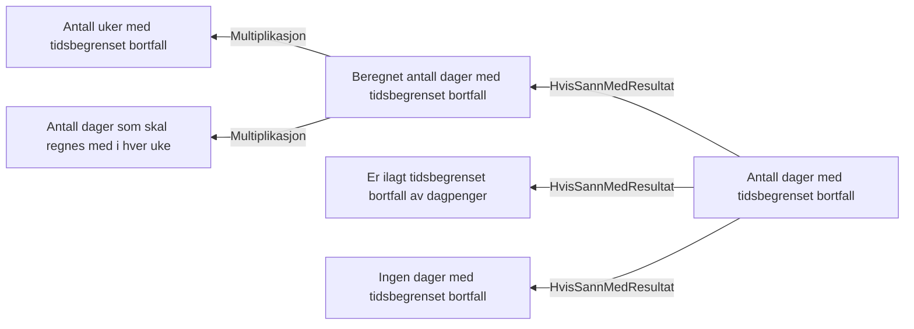

# § 4-20 Tidsbegrenset bortfall av dagpenger

## Regeltre



## Akseptansetester

```gherkin
#language: no
@dokumentasjon @regel-tidsbegrenset-bortfall
Egenskap: § 4-20 Tidsbegrenset bortfall av dagpenger

  Scenario: Ingen tidsbegrenset bortfall gir ingen bortfallsdager
    Gitt at søker har søkt om dagpenger for vurdering av tidsbegrenset bortfall
    Og saksbehandler ilegger ikke tidsbegrenset bortfall
    Så skal antall bortfallsdager være "0"

  Scenario: Tidsbegrenset bortfall med standard antall uker gir 90 bortfallsdager
    Gitt at søker har søkt om dagpenger for vurdering av tidsbegrenset bortfall
    Og saksbehandler ilegger tidsbegrenset bortfall
    Så skal antall bortfallsdager være "90"

  Scenariomal: Antall bortfallsdager beregnes ut fra antall bortfallsuker
    Gitt at søker har søkt om dagpenger for vurdering av tidsbegrenset bortfall
    Og saksbehandler ilegger tidsbegrenset bortfall i "<uker>" uker
    Så skal antall bortfallsdager være "<dager>"
  Eksempler:
    | uker | dager |
    | 18   | 90    |
    | 6    | 30    |
    | 1    | 5     |
``` 