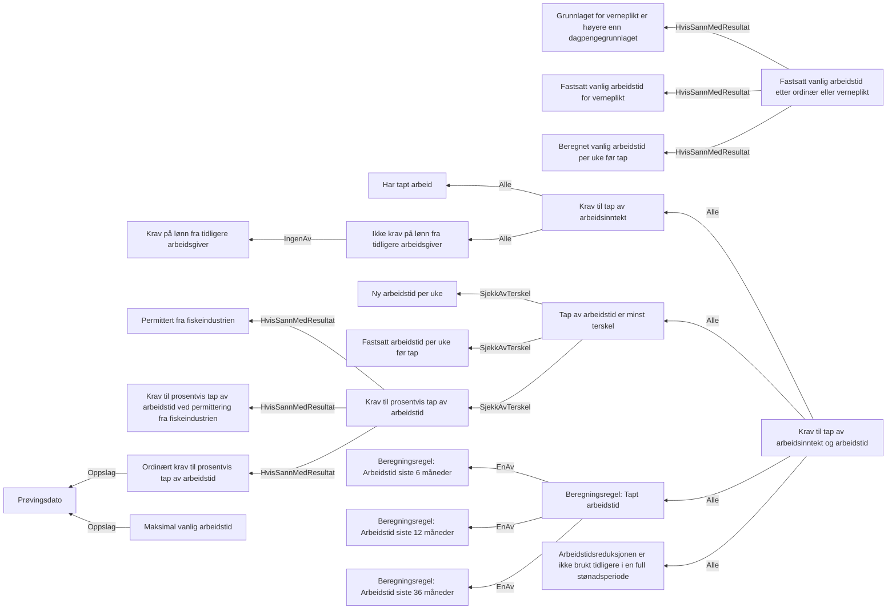

# § 4-3. Tap av arbeidsinntekt og arbeidstid

## Regeltre



## Akseptansetester

```gherkin
#language: no
@dokumentasjon @regel-tap-arbeidsinntekt-og-arbeidstid
Egenskap: § 4-3. Tap av arbeidsinntekt og arbeidstid

  Bakgrunn:
    Gitt at søknadsdatossssss er "01.04.2022"

  Scenariomal: Søker har tapt noe arbeid
    Gitt at personen har tapt arbeid
    Og personen har tapt arbeidsinntekt
    Og har fått fastsatt vanlig arbeidstid til <timer>
    Og har ny arbeidstid <ny arbeidstid>
    Og personen er permittert fra fiskeindustrien "<er permittert fra fiskeindustrien>"
    Når personen søker om dagpenger
    Så skal personen oppfylle kravet til tap av arbeidsinntekt
    Og personen skal "<utfall>" kravet til tap av arbeidstid
    Eksempler:
      | timer | ny arbeidstid | er permittert fra fiskeindustrien | utfall       |
      | 0     | 0             | Nei                               | ikke oppfylt |
      | 37,5  | 30            | Nei                               | ikke oppfylt |
      | 40    | 20            | Nei                               | oppfylt      |
      | 40    | 21            | Nei                               | ikke oppfylt |
      | 40    | 20,5          | Nei                               | ikke oppfylt |
      | 40    | 19,5          | Nei                               | oppfylt      |
      | 37,5  | 0             | Nei                               | oppfylt      |
      | 37,5  | 37,5          | Nei                               | ikke oppfylt |
      | 37,5  | 18            | Nei                               | oppfylt      |
      | 37,5  | 21            | Nei                               | ikke oppfylt |
      | 48    | 21            | Nei                               | ikke oppfylt |
      | 40    | 24,5          | Ja                                | ikke oppfylt |
      | 40    | 24            | Ja                                | oppfylt      |
``` 