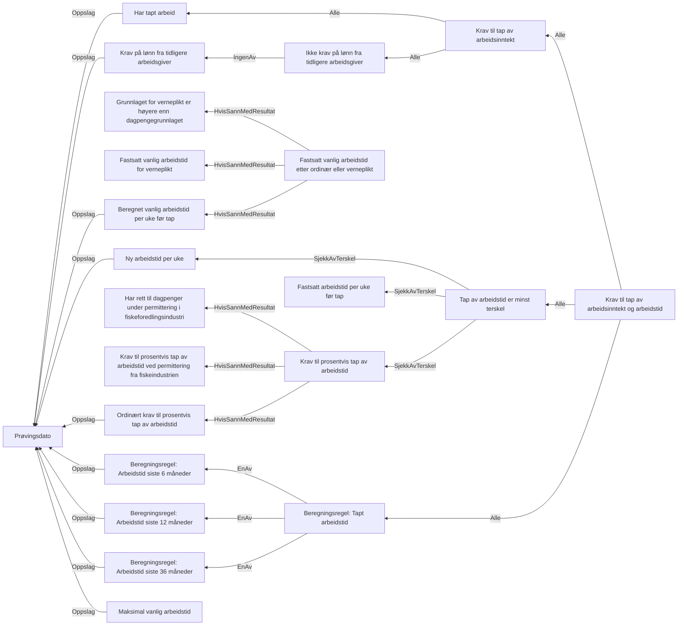

# § 4-3. Tap av arbeidsinntekt og arbeidstid

## Regeltre



## Akseptansetester

```gherkin
#language: no
@dokumentasjon @regel-tap-arbeidsinntekt-og-arbeidstid
Egenskap: § 4-3. Tap av arbeidsinntekt og arbeidstid

  Bakgrunn:
    Gitt at søknadsdatossssss er "01.04.2022"

  Scenariomal: Søker har tapt noe arbeid
    Gitt at personen har tapt arbeid
    Og personen har tapt arbeidsinntekt
    Og har fått fastsatt vanlig arbeidstid til <timer>
    Og har ny arbeidstid <ny arbeidstid>
    Når personen søker om dagpenger
    Så skal personen oppfylle kravet til tap av arbeidsinntekt
    Og personen skal "<utfall>" kravet til tap av arbeidstid
    Eksempler:
      | timer | ny arbeidstid | utfall       |
      | 0     | 0             | ikke oppfylt |
      | 37,5  | 30            | ikke oppfylt |
      | 40    | 20            | oppfylt      |
      | 40    | 21            | ikke oppfylt |
      | 40    | 20,5          | ikke oppfylt |
      | 40    | 19,5          | oppfylt      |
      | 37,5  | 0             | oppfylt      |
      | 37,5  | 37,5          | ikke oppfylt |
      | 37,5  | 18            | oppfylt      |
      | 37,5  | 21            | ikke oppfylt |
      | 48    | 21            | ikke oppfylt |
``` 