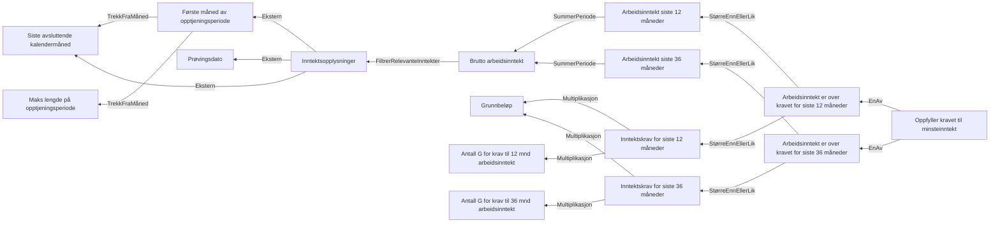

# § 4-4. Krav til minsteinntekt

## Regeltre



## Akseptansetester

```gherkin
#language: no
@dokumentasjon @regel-minsteinntekt
Egenskap: § 4-4. Krav til minsteinntekt

  Bakgrunn:
    Gitt at søknadsdato er "01.04.2022"

  Scenariomal: Søker oppfyller § 4-4. Krav til minsteinntekt
    Gitt at verneplikt er "<Verneplikt>"
    Og at inntekt er
      | Siste 12 måneder | <Siste 12 måneder> |
      | Siste 36 måneder | <Siste 36 måneder> |
    Så skal utfallet til minste arbeidsinntekt være "<utfall>"

    Eksempler:
      | Verneplikt | Siste 12 måneder | Siste 36 måneder | utfall |
      | Nei        | 0                | 0                | Nei    |
      | Nei        | 118620           | 0                | Nei    |
      | Nei        | 0                | 284688           | Nei    |
      | Nei        | 177930           | 0                | Ja     |
      | Nei        | 0                | 355860           | Ja     |
      | Ja         | 0                | 0                | Ja     |
``` 