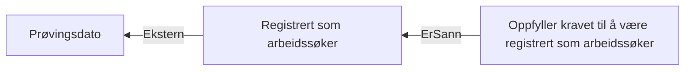

# § 4-5. Registrering som arbeidssøker

## Regeltre



## Akseptansetester

```gherkin
#language: no
@dokumentasjon @regel-registrert-arbeidssøker
Egenskap: § 4-5. Registrering som arbeidssøker

  Scenariomal: Søker fyller kravene til å være registrert arbeidssøker
    Gitt at personen søkte om dagpenger den "<søknadstidspunktet>"
    Og personen var registrert? "<var registrert>" på "<registreringsdato>"
    Så er kravet til å være registrert arbeidssøker "<utfall>"

    Eksempler:
      | søknadstidspunktet | var registrert | registreringsdato | utfall       |
      | 10.05.2022         | Ja             | 10.05.2022        | Oppfylt      |
      | 10.05.2022         | Nei            | 10.05.2022        | Ikke oppfylt |
      | 15.05.2022         | Ja             | 15.05.2022        | Oppfylt      |
``` 