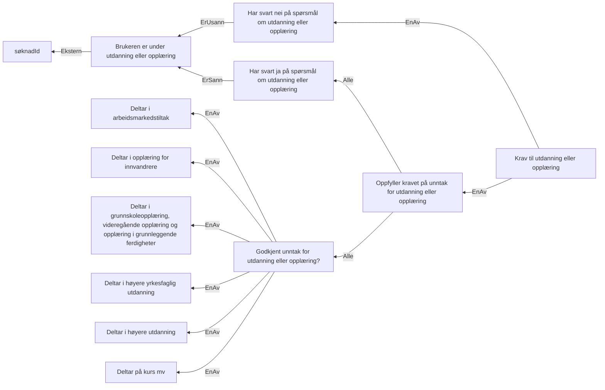

# § 4-6 Utdanning - første og andre avsnitt

## Regeltre



## Akseptansetester

```gherkin
#language: no
@dokumentasjon @regel-utdanning
Egenskap: § 4-6 Utdanning - første og andre avsnitt

  Scenariomal: Søker oppfyller kravet til utdanning
    Gitt at personen søker på kravet om dagpenger
    Og at søkeren svarer "<utdanning>" på spørsmålet om utdanning
    Og at unntaket arbeidsmarkedstiltak er "<arbeidsmarkedstiltak>"
    Og at unntaket opplæring for innvandrere er "<opplæring for innvandrere>"
    Og at unntaket grunnskoleopplæring er "<grunnskoleopplæring>"
    Og at unntaket høyere yrkesfaglig utdanning er "<høyere yrkesfaglig utdanning>"
    Og at unntaket høyere utdanning er "<høyere utdanning>"
    Og at unntaket deltar på kurs er "<deltar på kurs>"
    Så skal utfallet om utdanning være "<utfall>"

    Eksempler:
      | utdanning | arbeidsmarkedstiltak | opplæring for innvandrere | grunnskoleopplæring | høyere yrkesfaglig utdanning | høyere utdanning | deltar på kurs | utfall |
      | Nei       | Nei                  | Nei                       | Nei                 | Nei                          | Nei              | Nei            | Ja     |
      | Ja        | Nei                  | Nei                       | Nei                 | Nei                          | Nei              | Nei            | Nei    |
      | Ja        | Ja                   | Nei                       | Nei                 | Nei                          | Nei              | Nei            | Ja     |
      | Ja        | Nei                  | Ja                        | Nei                 | Nei                          | Nei              | Nei            | Ja     |
      | Ja        | Nei                  | Nei                       | Ja                  | Nei                          | Nei              | Nei            | Ja     |
      | Ja        | Nei                  | Nei                       | Nei                 | Ja                           | Nei              | Nei            | Ja     |
      | Ja        | Nei                  | Nei                       | Nei                 | Nei                          | Ja               | Nei            | Ja     |
      | Ja        | Nei                  | Nei                       | Nei                 | Nei                          | Nei              | Ja             | Ja     |
``` 