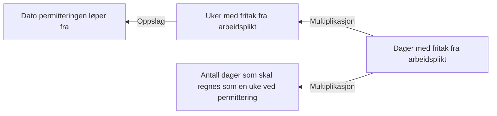

# § 4-7 Permittering (fastsetting)

## Regeltre



## Akseptansetester

```gherkin
#language: no
@dokumentasjon @regel-permittering-fastsetting
Egenskap: § 4-7 Permittering (fastsetting)

  Scenariomal: Søker oppfyller kravet til permittering under fastsetting
    Gitt at søker skal innvilges "<utfall>" med permittering
    Så skal søker få <periode> uker med permittering

  Eksempler:
   | utfall | periode |
   | Nei    | 0       |
   | Ja     | 26      |
``` 