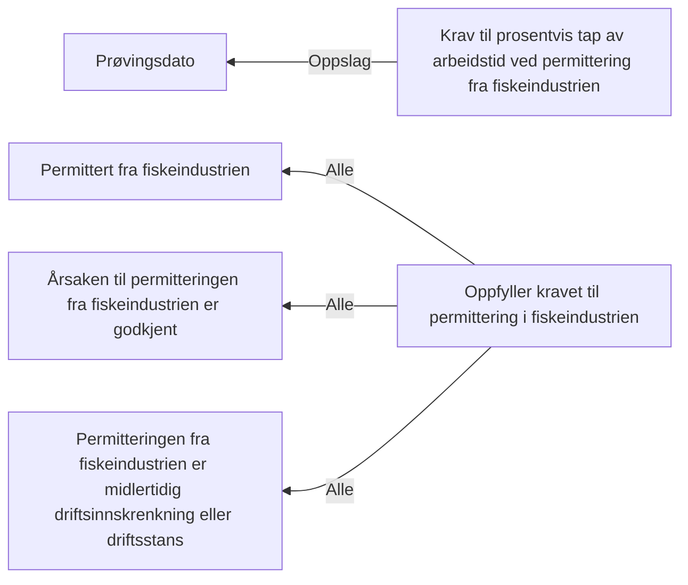

# § 4-7 Permittering Fiskeindustrien

## Regeltre



## Akseptansetester

```gherkin
#language: no
@dokumentasjon @regel-permittering-fiskeindustrien
Egenskap: § 4-7 Permittering Fiskeindustrien

  Scenariomal: Søker oppfyller kravet til permittering fra fiskeindustrien
    Gitt at søker har "<er permittert>" om dagpenger under permittering fra fiskeindustrien
    Og saksbehandler vurderer at søker har "<godkjent årsak>" til permittering fra fiskeindustrien
    Og vurderer at søker har "<midlertidig>" permittering fra fiskeindustrien
    Så skal søker få "<utfall>" av permittering fra fiskeindustrien

  Eksempler:
    | er permittert | godkjent årsak | midlertidig | utfall |
    | Nei           | Nei            | Nei         | Nei    |
    | Nei           | Ja             | Nei         | Nei    |
    | Nei           | Nei            | Ja          | Nei    |
    | Ja            | Nei            | Nei         | Nei    |
    | Ja            | Ja             | Nei         | Nei    |
    | Ja            | Nei            | Ja          | Nei    |
    | Ja            | Ja             | Ja          | Ja     |
``` 