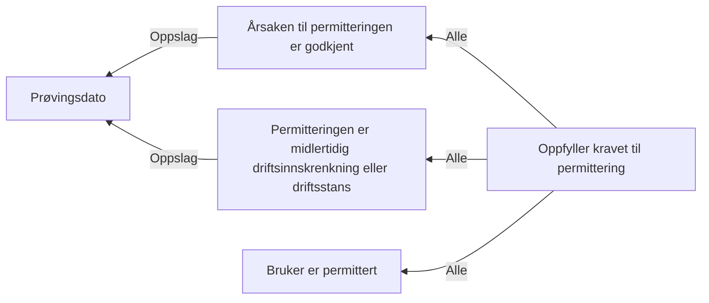

# § 4-7 Permittering

## Regeltre



## Akseptansetester

```gherkin
#language: no
@dokumentasjon @regel-permittering
Egenskap: § 4-7 Permittering

  Scenariomal: Søker oppfyller kravet til permittering
    Gitt at søker har "<er permittert>" om dagpenger under permittering
    Og saksbehandler vurderer at søker har "<godkjent årsak>" til permittering
    Og vurderer at søker har "<midlertidig>" permittering
    Så skal søker få "<utfall>" av permittering

  Eksempler:
    | er permittert | godkjent årsak | midlertidig | utfall |
    | Nei           | Nei            | Nei         | Nei    |
    | Nei           | Ja             | Nei         | Nei    |
    | Nei           | Nei            | Ja          | Nei    |
    | Ja            | Nei            | Nei         | Nei    |
    | Ja            | Ja             | Nei         | Nei    |
    | Ja            | Nei            | Ja          | Nei    |
    | Ja            | Ja             | Ja          | Ja     |
``` 