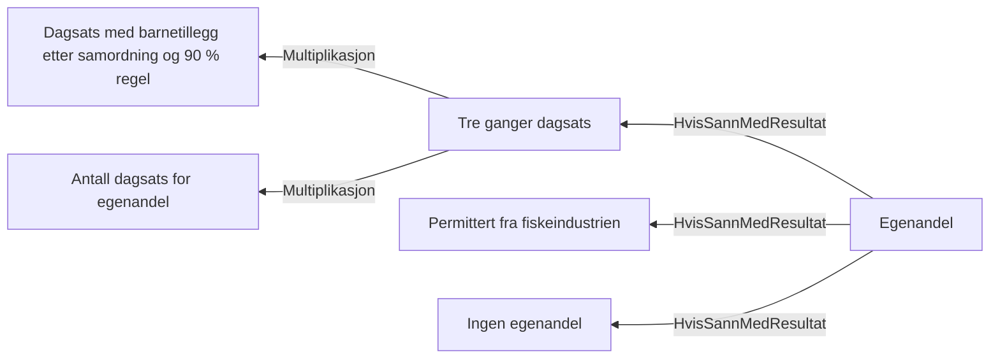

# § 4-9. Egenandel

## Regeltre



## Akseptansetester

```gherkin
#language: no
@dokumentasjon @regel-egenandel
Egenskap: § 4-9. Egenandel

  Scenario: Egenandel skal være 3 ganger dagsats
    Gitt at sats er "591"
    Og søker har ikke permittering fra fiskeindustrien
    Så skal egenandel være "1773"

  Scenario: Ingen egenandel ved permittering fra fiskeindustrien
    Gitt at sats er "591"
    Og søker har permittering fra fiskeindustrien
    Så skal egenandel være "0"
``` 